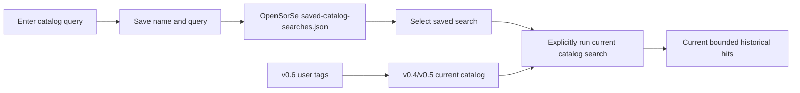

# OpenSorSe v0.7 Release Proposal

| Field | Value |
| --- | --- |
| Target release | v0.7 |
| Theme | Bounded saved catalog searches |
| Scope type | Local query-preset persistence and repeatable discovery |
| Depends on | v0.5 catalog-wide deterministic search and v0.6 user-managed searchable tags |

## 1. Purpose and user value

v0.5 can search the local catalog and v0.6 lets users create personal metadata labels, but frequently used queries must still be retyped after every restart. v0.7 adds named saved catalog searches. A saved search stores only a display name and deterministic query text, then reruns the existing catalog search against current saved snapshots when explicitly requested.

In scope:

- Save up to 25 named, non-empty catalog query presets in a separate OpenSorSe-owned JSON file.
- List saved searches newest-updated first, choose one, and rerun it through the existing bounded search workflow.
- Remove a selected preset or use a two-step reset for all saved-query data.
- Recover from malformed saved-query data through the explicit reset path.
- Preserve cancellation, stable ranking, historical snapshot opening, and catalog invalidation behavior.

Out of scope:

- Persisting search hits, a search index, background execution, notifications, scheduling, live folders, full Results filters, content extraction, semantic search, embeddings, database migration, cloud sync, or query analytics.
- Running a saved search automatically at startup.
- Modifying user files or storing file contents.

## 2. Dependencies and user flow

1. With catalog storage enabled, the user enters a query and a distinct display name, then saves it.
2. On a later application run, saved searches load on demand without opening catalog snapshots.
3. The user selects **Run selected**. The preset populates the current query and invokes v0.5 search against the catalog as it exists now, including v0.6 user tags persisted in entries.
4. The user may remove one preset or request and separately confirm reset of all saved-query data. These actions never affect catalog snapshots, settings, decision history, logs, or scanned files.
5. If the saved-query file is malformed, listing reports it unavailable and explicit reset remains available so the user can recover.

## 3. Architecture and changed data flow

`OpenSorSe.Application.CatalogSearch` owns `SavedCatalogSearch`, limits, `ISavedCatalogSearchStore`, and `JsonSavedCatalogSearchStore`. The service uses a version-one JSON envelope, a per-instance semaphore, immutable returned collections, and temporary-file replacement. It depends only on Core logging; it has no scanner, Results, UI, executor, or AI dependency.

The saved-query file is a sibling of `settings.json` and `catalog.json`, but intentionally separate. Catalog clear/remove continues to mean snapshot data only, while saved-query maintenance has its own explicit controls and corruption recovery. Separating the files avoids coupling a query-preset parse failure to historical results.

`CatalogSearchViewModel` coordinates preset state and the existing v0.5 search state. Running a preset copies its query into `QueryText` and awaits `SearchAsync`; it does not cache or persist hits. `MainViewModel` initializes/refreshes presets on Catalog Search navigation and disposes the combined state through the existing child lifetime.

## 4. Models, interfaces, and bounds

`SavedCatalogSearch` contains an opaque ID, trimmed display name, trimmed query text, created UTC timestamp, and updated UTC timestamp. Names are at most 80 characters; query text is at most 512 characters; no more than 25 records may exist. A save that would exceed capacity is rejected without evicting user data. Names are unique case-insensitively at the ViewModel workflow boundary.

`ISavedCatalogSearchStore` lists, saves/replaces, removes, and clears only its configured absolute application-data file. Clear is deliberately valid even when parsing fails so the explicit two-step UI can recover corrupted app-owned state.

## 5. UI, errors, cancellation, and recovery

| State | Required behavior |
| --- | --- |
| No presets | Explain that a named query can be saved; search remains usable. |
| Loading | Disable overlapping preset commands and preserve the last valid list. |
| Saved | Selectable name/query/update timestamp; no hit data retained. |
| Catalog disabled | Presets can be listed or removed for privacy, but saving/running is disabled with an opt-in explanation. |
| Duplicate name | Reject without replacing another preset. |
| Capacity reached | Reject the new preset without evicting existing presets. |
| Missing selected preset | No operation; keep current query/hits. |
| Corrupt/unavailable file | Preserve the file, show generic status, and allow separately confirmed reset. |
| Reset requested | First action changes UI state only; confirmation clears the saved-query file. |
| Cancelled operation | Preserve prior valid state and remain repeatable. |

All store methods observe cancellation before and while waiting for the store lock and during JSON I/O. Preset operations use their own replacement cancellation source. Running a search delegates to v0.5's versioned cancellation, so a newer search cannot publish stale hits. Shutdown disposal cancels pending preset and search work.

## 6. Safety, privacy, compatibility, migration, and rollback

- Storage is limited to a user-chosen display name and query text; hits, file contents, hashes, and extracted text are never written.
- Queries can contain personal terms, so the UI discloses the exact local application-data persistence boundary.
- The store writes only its absolute configured file and temporary sibling. It never evaluates paths in query text.
- v0.1-v0.6 behavior and catalog schema version one remain unchanged. No migration is required.
- Removing v0.7 code leaves `saved-catalog-searches.json` as an unused bounded app-data file; explicit reset is the supported rollback cleanup.
- Path construction uses existing cross-platform `Environment.SpecialFolder.LocalApplicationData` and `Path.Combine`; validation tests use disposable temporary directories.

## 7. Performance, testing, and acceptance criteria

Listing and rendering are bounded to 25 records. Saving serializes at most 25 small records. Running a preset has exactly the same catalog cost and 200-hit presentation cap as v0.5; no background or repeated automatic search is introduced.

Automated tests cover round trip, replacement, stable order, capacity rejection, input validation, cancellation, malformed data preservation, corrupt-data reset, remove/clear isolation, disabled behavior, duplicate names, save/run/remove/reset commands, stale cancellation, and v0.6 tag matching. The full v0.1-v0.6 suite remains regression coverage.

Acceptance requires that saved queries survive restart, rerun against current catalog state, find current persisted user tags, never persist hits, recover through explicit reset, and cannot mutate user files. Restore/build/tests/analyzers/diff checks must pass where the environment permits.

## 8. Delivery phases and risks

| Phase | Deliverable | Exit criteria |
| --- | --- | --- |
| 1 | Bounded atomic store | Persistence, corruption, cancellation, and capacity tests pass. |
| 2 | Catalog Search integration | Save/list/run/remove/reset and v0.6-tag interaction tests pass. |
| 3 | Version/docs/review | v0.7 version, safety, architecture, roadmap, and complete validation agree. |

| Risk | Mitigation |
| --- | --- |
| Query terms expose private interests | Local application-data only, explicit disclosure, delete/reset controls, no hit persistence. |
| Preset results appear stale | Running always evaluates the current catalog; no hits are stored in the preset. |
| Corrupt presets block catalog search | Separate file and state; existing ad hoc search continues, explicit reset recovers presets. |
| Silent retention loses user presets | Reject the twenty-sixth record instead of evicting an existing one. |
| Older behavior is bypassed | Run delegates directly to existing `SearchAsync`, ranking, limits, cancellation, and open flow. |

Update README, roadmap, release status, search/catalog GUI architecture, system diagrams, persistence/privacy documentation, configuration reference, project philosophy, and implementation decisions. Mark saved searches implemented while keeping semantic search, content search, and persistent indexes deferred.
