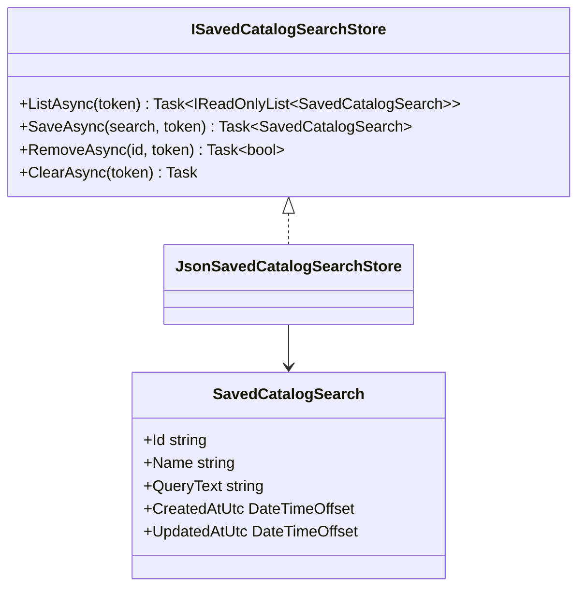

# Specification 040 — Saved Catalog Search Store

| Field | Value |
| --- | --- |
| Component | Application-owned saved-query persistence |
| Target release | v0.7 |
| Dependencies | Core logging and .NET JSON/I/O |

## Contract

`ISavedCatalogSearchStore` shall provide cancellable `ListAsync`, `SaveAsync`, `RemoveAsync`, and `ClearAsync` operations. It shall not load catalog snapshots, execute a query, inspect a result path, or depend on Desktop types.

## Validation and deterministic behavior

- The configured file path must be absolute.
- IDs are required, trimmed, and at most 128 characters.
- Names are required, trimmed, control-character-free, and at most 80 characters.
- Queries are required, trimmed, control-character-free except ordinary whitespace (`tab`, `CR`, and `LF`), and at most 512 characters.
- Created/updated timestamps must be UTC and updated must not precede created.
- Records are returned updated-newest first, then name case-insensitively, then ID ordinally.
- Replacing the same ID does not consume capacity. A distinct twenty-sixth ID throws `SavedCatalogSearchCapacityExceededException` without writing.
- Returned records and lists are sanitized immutable values.

## Persistence, atomicity, cancellation, and recovery

The file is `saved-catalog-searches.json` under OpenSorSe local application data in production. The envelope schema version is one. JSON enums are string-compatible by convention even though the initial model has no enum. A semaphore serializes operations.

Save creates a temporary sibling, serializes the complete envelope, and moves it over the target only after success. The temporary file is removed in `finally`. Missing data means an empty list. Malformed, unsupported, duplicated, oversized, or invalid data is preserved and reported as `InvalidDataException`; normal list/save/remove operations never repair it automatically.

`ClearAsync` is the explicit recovery exception: after the Desktop's separate confirmation, it deletes only the configured saved-query file without first parsing it. Cancellation is checked before lock acquisition and immediately before deletion. This permits user-authorized recovery from corruption without risking catalog snapshots or user files.

## Safety and tests

Tests use unique temporary directories and delete only their own exact paths. They cover valid round trip, replacement, stable order, twenty-sixth rejection, malformed and unsupported preservation, invalid records, pre-cancellation, remove isolation, and clear of valid/malformed state. No test path may be a user folder.
