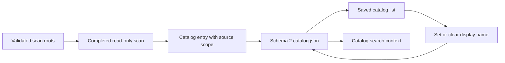

# OpenSorSe v0.8 Release Proposal

| Field | Value |
| --- | --- |
| Target release | v0.8 |
| Theme | Identifiable, scope-aware catalog snapshots |
| Scope type | Backward-compatible catalog metadata and desktop workflow |
| Depends on | v0.4 bounded catalog, v0.5 maintenance/search, v0.6 tags, v0.7 saved searches |

## 1. Purpose and user value

The v0.4-v0.7 catalog can retain, search, and reopen a historical scan, but a saved entry is identified only by its UTC timestamp and counts. It also does not retain the selected scan roots that define the snapshot's scope. Once several snapshots exist, users cannot give them a durable human meaning or reliably tell whether two entries cover comparable folders.

v0.8 adds an optional user-controlled display name and the bounded source-root set supplied to the completed scan. Existing entries remain readable and are explicitly shown as having unknown source scope. The feature changes OpenSorSe-owned metadata only and never opens or modifies a stored path.

## 2. Scope and non-scope

In scope:

- Catalog schema version 2 with backward-compatible version 1 reads.
- An optional, trimmed display name of at most 80 characters.
- Up to 32 source-root strings of at most 2,048 characters each, captured only for newly completed catalog-backed scans.
- Catalog list presentation of the display name and source scope.
- Explicit set, replace, and clear-name commands for a selected entry.
- Display-name context in catalog search hits.
- Atomic migration on the next user-authorized or normal catalog write; read-only listing never rewrites data.

Out of scope:

- Renaming, moving, deleting, opening, revealing, refreshing, or rescanning a user file or folder.
- Verifying whether a stored root still exists.
- Editing source roots after a scan, because that would falsify snapshot provenance.
- Notes, folders of snapshots, arbitrary metadata fields, export, reports, databases, content indexing, semantic search, monitoring, cloud synchronization, or telemetry.

## 3. Evidence and scope decision

The roadmap leaves v0.8 unassigned and describes database catalogs, report export, content readers, semantic search, operation execution, and plugins as future ideas. The implemented Catalog page and Specifications 035-038 expose only time/count summaries, while `CatalogEntry` contains no scan-request scope. The smallest pre-1.0 correction is therefore durable snapshot identity and provenance, not a new subsystem.

This release belongs before v1.0 because catalog entries are already persistent user-curated application data, and clear identity is necessary before adding any cross-snapshot workflow. Larger storage and search alternatives remain deferred because bounded JSON already satisfies the implemented scale and safety model.

## 4. User stories and flows

- As a catalog user, I can label a saved snapshot so I can recognize its purpose after restart.
- As a privacy-conscious user, I can clear a label without removing the snapshot.
- As a reviewer, I can see which selected roots produced a new snapshot without OpenSorSe touching those paths again.
- As an existing user, I can open a schema-1 catalog and see an explicit unknown-scope state.

## 5. Functional and domain requirements

`CatalogEntry` and `CatalogEntrySummary` gain optional `DisplayName` and immutable `SourceRoots`. Existing positional constructors remain source-compatible. Blank names normalize to `null`; nonblank names are trimmed, reject control characters, and are bounded. Source roots are trimmed, required when present, control-character-free, bounded, de-duplicated with platform-neutral catalog path identity, and retain deterministic user selection order.

The Desktop captures roots from the already-validated `ScanRequest`; the catalog store does not access or validate the live filesystem. A source-root capacity violation declines catalog persistence without invalidating the completed in-memory scan.

## 6. Architecture and component ownership

`OpenSorSe.Application.Catalog` owns the schema, validation, sanitization, migration compatibility, and limits. `OpenSorSe.Desktop` owns label input, commands, status, and XAML. `MainViewModel` transfers an immutable copy of the completed request roots to the catalog entry. Catalog Search receives label context from the loaded entry but preserves its v0.5 ranking and 200-hit cap.

No Scanner, Rules, Executor, AI, or Core interface changes are required. Dependency injection and service lifetimes remain unchanged.

## 7. Persistence, compatibility, migration, and rollback

The `catalog.json` envelope schema advances from 1 to 2. Version 1 and version 2 are accepted; absent metadata becomes `DisplayName = null` and an empty source-root collection. The next successful save serializes the entire bounded envelope as version 2 through the existing temporary-sibling replacement. Merely listing or opening old data does not rewrite it.

Malformed, duplicated, unsupported, or invalid data remains unavailable and untouched. Rolling back to v0.7 leaves a schema-2 file that v0.7 intentionally rejects as unsupported; the supported rollback is to keep the v0.8+ application or explicitly clear application-owned catalog data after review. Selected user files are never involved.

## 8. UI, navigation, errors, and accessibility

The existing Saved Catalog page remains the only editing surface. Selecting a row populates a labelled text input. **Save snapshot name** sets or replaces the value; whitespace-only input clears it. Disabled catalog, no selection, invalid input, capacity, cancellation, corrupt data, missing entry, and I/O failure have distinct user-safe messages. A failed update retains the last published list and input.

Rows expose a meaningful accessible text hierarchy: display name or `Unnamed snapshot`, saved UTC time, source scope or `Source scope unknown`, and existing counts. Keyboard users can select a row, focus the text box, save, or clear without pointer-only interaction. Repeated navigation refreshes current summaries and does not create writes.

## 9. Cancellation, concurrency, ordering, and capacity

The existing one-operation-at-a-time Catalog ViewModel cancellation and store semaphore apply. A newer operation cancels the earlier token; only a successfully loaded selected ID may be replaced. Store ordering remains saved-time descending then catalog ID descending and does not depend on mutable labels.

Capacity remains ten entries and 2,000 files per entry. Names, roots, and root length have explicit limits. Collections returned by the store are immutable copies. No cache or persisted collection becomes unbounded.

## 10. Safety, privacy, and cross-platform behavior

Source roots and labels are personal metadata. They are persisted only when the user has enabled the already-disclosed catalog, only under OpenSorSe local application data, and never uploaded. The feature stores no file bytes, content excerpts, hashes, credentials, or live-state result.

Stored paths are opaque historical strings after capture. Windows drive/UNC identity is case-insensitive and separator-neutral; Unix-style identity preserves case. Display and migration do not call `File`, `Directory`, shell, or Executor APIs. Filesystem tests use unique disposable directories only for the application-owned JSON file.

## 11. Testing strategy and acceptance criteria

Automated tests cover schema-2 round trip, schema-1 compatibility, name/root sanitization, duplicate roots, bounds, immutable results, label set/replace/clear, invalid input, disabled state, missing/corrupt store behavior, selection refresh, root capture from a completed scan, search-hit context, and v0.4-v0.7 regression behavior.

The release is accepted when:

- Existing schema-1 catalogs list and open without mutation.
- New snapshots retain bounded source scope after restart.
- A selected snapshot name can be set, replaced, and cleared without changing its contents or any user file.
- Search hits show the snapshot name without changing deterministic ranking.
- Empty, cancellation, corrupt, maximum-capacity, repeated-command, and navigation states remain usable.
- Restore, build, full tests, analyzers, diff, and documentation checks pass where the environment permits.

## 12. Delivery phases, risks, and documentation

| Phase | Deliverable | Exit criterion |
| --- | --- | --- |
| 1 | Schema-2 application model and migration | Store and compatibility tests pass. |
| 2 | Catalog/search/Desktop integration | End-to-end label and source-scope tests pass. |
| 3 | Review and documentation | Full regression suite and documentation checks pass. |

| Risk | Mitigation |
| --- | --- |
| Old data is destroyed during migration | Read accepts v1 without writing; only atomic successful saves emit v2. |
| A label is mistaken for filesystem metadata | UI states it is OpenSorSe metadata; source files are never touched. |
| Paths leak through diagnostics | User messages remain generic; no new raw-path logging. |
| Scope is misleading for old entries | Empty roots are displayed as unknown, never inferred from file paths. |

Update README, roadmap, release status, system/component/data/user flows, catalog GUI, configuration/persistence notes, project philosophy, and the implementation-specification index. Historical v0.4-v0.7 documents remain records of their releases.
