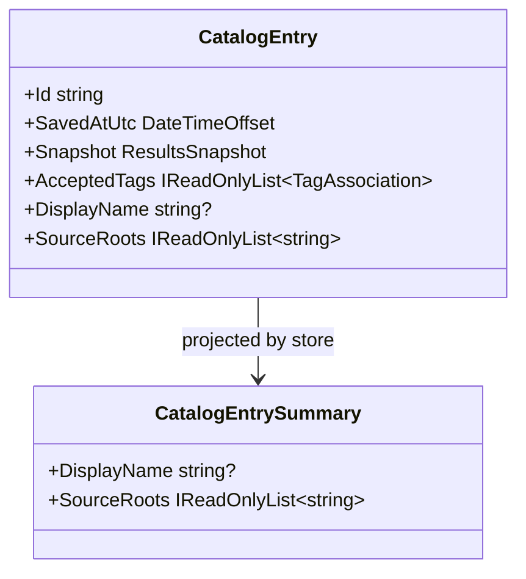

# Specification 042 - Catalog Snapshot Identity and Migration

| Field | Value |
| --- | --- |
| Component | Catalog models, validation, schema migration, and bounded persistence |
| Target release | v0.8 |
| Dependencies | Specifications 035 and 038 |

## Contract

`CatalogEntry` and `CatalogEntrySummary` shall expose an optional display name and immutable source-root list without breaking existing constructor call sites. `CatalogLimits` shall define 80 characters per name, 32 roots, and 2,048 characters per root.

The store shall normalize blank names to `null`, trim valid values, reject name/root control characters, reject over-capacity metadata before replacing existing data, de-duplicate equivalent source roots deterministically, and preserve their first-seen order. It shall clone all exposed collections.

## Data format and migration

`JsonResultsCatalogStore` shall write schema 2 and read schemas 1 and 2. Schema 1's absent values normalize to no name and unknown scope. No read method may migrate or rewrite a file. Every subsequent successful save uses the existing atomic full-envelope write and version 2.

Unsupported versions, duplicate IDs, invalid entries, malformed JSON, and over-limit stored data shall remain preserved and throw `InvalidDataException`. Pre-cancellation shall create no directories. A metadata-capacity failure shall leave the previous catalog byte sequence intact.

## Safety and cross-platform rules

The store treats roots as historical metadata, never as filesystem instructions. It must not call existence checks, enumerate roots, resolve links, or normalize through the current host filesystem. Catalog path identity shall normalize separators and Windows drive/UNC case for duplicate detection while preserving Unix case.

## Tests

- Schema 2 round-trips name and source roots as immutable values.
- A schema 1 envelope loads with null name/unknown scope and is not rewritten by list/load.
- A later save upgrades the envelope to schema 2 atomically.
- Whitespace names clear; invalid/oversized names and roots fail without data loss.
- Equivalent Windows roots de-duplicate; Unix case-distinct roots remain distinct.
- Existing tags, retention, removal, clear, corruption, cancellation, and file-count bounds still pass.
