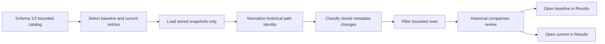

# OpenSorSe v0.9 Release Proposal

| Field | Value |
| --- | --- |
| Target release | v0.9 |
| Theme | Bounded historical snapshot comparison and pre-1.0 hardening |
| Scope type | Deterministic catalog analysis and desktop workflow |
| Depends on | v0.8 catalog names, source scope, schema 2, and all v0.4-v0.7 catalog behavior |

## 1. Purpose and user value

OpenSorSe can retain, label, search, and reopen scan snapshots, but a user still has to inspect them separately to understand what changed. v0.9 adds a deterministic comparison of two explicitly selected historical snapshots using only already-persisted display-safe metadata and accepted tags. It is the final focused pre-1.0 workflow and reliability release: it turns the catalog into a useful longitudinal review tool without introducing live monitoring, a database, or user-file mutation.

Users can identify added, removed, modified, and unchanged stored file records; inspect which metadata fields changed; filter the bounded result; see whether the v0.8 source scopes match; cancel comparison; and open either complete historical snapshot in the existing Results Explorer.

## 2. Scope and explicit non-goals

In scope:

- A pure Application-layer comparison service with explicit cancellation and deterministic ordering.
- Cross-platform catalog path identity shared with v0.8 provenance validation.
- Added, removed, modified, and unchanged classifications.
- Modified-field detection for size, last-write timestamp, extension, category, classification display, duplicate status, planned-operation preview state, and accepted non-deterministic tags.
- Same/different/unknown source-scope assessment.
- Deterministic handling and visible aggregate warning for duplicate path identities within a snapshot.
- A top-level **Compare snapshots** MVVM/View workflow with refresh, selection, compare, cancel, filter, path text filter, result statistics, scope warning, and historical snapshot opening.
- A 4,000-change application bound and 500-row presentation bound.
- Full regression, accessibility, documentation, version, and release-readiness passes.

Out of scope:

- Live filesystem existence checks, change verification, rescans, background monitoring, watchers, scheduling, or notifications.
- Comparing file contents or hashes; raw hashes are not persisted in result snapshots.
- Rename detection, because matching different paths without content identity would be guesswork.
- Export, generated reports, charts, databases, full-content indexes, semantic search, embeddings, cloud synchronization, telemetry, plugins, or operation execution.
- Modifying catalog entries, tags, saved searches, or user files from the comparison result.

## 3. Evidence and scope decision

The roadmap leaves v0.9 unassigned and reserves database catalogs, semantic/content search, execution, and plugins for future ideas. v0.4-v0.7 created a complete bounded historical catalog workflow, and v0.8 supplies the missing snapshot identity and source provenance needed to choose sensible comparison inputs. Current architecture explicitly calls snapshots historical and forbids live refresh. A stored-metadata comparison is therefore the clearest remaining pre-1.0 user value that fits existing boundaries.

The future Reports documents describe export-oriented subsystems that do not exist and would authorize new writes. v0.9 does not implement or claim that architecture; comparison is an on-screen Application analysis of two bounded entries. Database migration, content readers, rename inference, and monitoring remain v1.0-or-later decisions because they require different privacy, capacity, or correctness designs.

## 4. Dependencies, user stories, and changed flow

- As a user, I can select a baseline and a newer saved snapshot and see deterministic stored-metadata changes.
- As a reviewer, I am warned if their captured source scopes differ or are unknown.
- As a tag user, I can see that accepted application-owned tag changes make a file modified.
- As a user with a large catalog entry, I get aggregate totals and a bounded, filterable row list instead of an unresponsive control.
- As a cautious user, I can cancel and know the comparison has not accessed a stored path.

## 5. Functional requirements and deterministic semantics

Selections must be distinct catalog IDs. A missing, removed, corrupt, disabled, or unavailable entry produces a recoverable status and never clears unrelated Results state. Matching uses `CatalogPathIdentity.Normalize`: Windows drive and UNC paths are separator-neutral and case-insensitive; Unix-rooted paths preserve case. The first deterministic file record for a duplicate identity participates, while additional records are counted and reported without exposing paths in an error.

The comparison returns the ordinally path-sorted union. Added has only a current record; removed has only a baseline record; modified has both plus at least one changed field; unchanged has both and no changed field. Tag comparison uses sorted distinct normalized values from accepted non-deterministic associations mapped through each snapshot's opaque file IDs.

## 6. Domain models, service boundary, and ownership

`OpenSorSe.Application.CatalogComparison` owns:

- `ICatalogComparisonService` and `CatalogComparisonService`.
- Change-kind and scope-match enums.
- Immutable change, statistics, and result records.
- Fixed limits and all normalization/comparison logic.

The service accepts two already-loaded `CatalogEntry` values and a cancellation token. It has no UI, store, scanner, executor, AI, logging, or filesystem dependency. The Desktop ViewModel owns store loading, stale-operation protection, filters, presentation limits, events, and messages. The shell owns navigation and reuses the established catalog-entry-to-Results path.

## 7. UI, navigation, accessibility, and states

Add `NavigationDestination.CatalogComparison`, a shell item titled **Compare snapshots**, `CatalogComparisonViewModel`, row models, and `CatalogComparisonView`. Baseline/current selectors use the v0.8 name fallback, UTC time, and scope context. The primary action is **Compare selected snapshots** and a visible **Cancel comparison** action is enabled only while work is active.

Filters include Changed, Added, Removed, Modified, Unchanged, and All. A bounded text filter matches stored path and filename only. Result rows state change kind, path, changed fields, baseline summary, and current summary in text; state never relies only on color. Buttons can open either selected complete snapshot through the existing historical Results surface. Empty catalog, fewer than two entries, empty snapshots, no filter matches, loading, cancelled, corrupt, duplicate selection, scope mismatch, and duplicate-record states are explicit.

## 8. Persistence, migration, compatibility, and rollback

v0.9 adds no persistence and does not change schema 2. It reads through `IResultsCatalogStore`, so v0.4-v0.7 schema-1 data remains loadable through v0.8 migration compatibility with unknown scope. Names and roots are optional. Tags and saved-query files remain unchanged. No comparison result, filter text, statistics, or selection is persisted.

Removing v0.9 code leaves no new application data. Rollback to v0.8 is therefore immediate at the feature level. Rollback earlier than v0.8 retains the schema-2 caveat documented in that release.

## 9. Errors, cancellation, concurrency, failure recovery, and capacity

All store calls and CPU comparison observe the replacement cancellation token. A new refresh or comparison cancels the old operation; only the current operation publishes rows. Explicit cancel retains selectors, clears busy state, and reports cancellation. Navigation away does not start background work; disposal cancels active work.

Each side is already bounded to 2,000 files; the service independently enforces that limit. The union is at most 4,000 changes. The ViewModel retains that immutable bounded result but publishes at most 500 rows for the active filters. The filter text is at most 512 characters. Stable ordering is kind (added, removed, modified, unchanged where applicable), then normalized path, display path, and stable file IDs.

## 10. Safety, privacy, and cross-platform implications

Comparison uses only OpenSorSe-owned historical JSON already loaded through the catalog contract. It does not call file or directory APIs, resolve links, follow reparse points, open a path, execute a file, upload metadata, or write beside a scanned folder. It stores nothing new. UI wording repeatedly identifies the result as historical, not proof of current disk state.

Paths and tags remain private local metadata. No raw path is added to diagnostic logging. Platform-neutral identity prevents a Windows catalog opened on another host from changing case behavior, while preserving valid case distinctions for Unix paths.

## 11. Cross-feature interaction matrix

| Existing feature | v0.9 interaction |
| --- | --- |
| v0.4 catalog | Loads only bounded stored entries; no schema bypass. |
| v0.5 search/maintenance | Catalog changes invalidate comparison; search ranking is unchanged. |
| v0.6 tags | Accepted normalized tag-set differences mark a matched path modified. |
| v0.7 saved searches | No query or hit is read or written by comparison. |
| v0.8 identity/scope | Names identify selectors; roots produce same/different/unknown scope state. |
| Results Explorer | Baseline/current opening reuses historical snapshot loading and tags. |
| Optional AI | No provider call or decision-history access. |

## 12. Testing, acceptance, and release-readiness criteria

Application tests cover every change kind and field, tag changes, path semantics, scope match, stable order, duplicate records, empty data, limits, and pre/mid cancellation. Desktop tests cover disabled/empty states, refresh/selection, duplicate selection, comparison and filters, 500-row cap, text validation, cancellation, stale operation, missing/corrupt entries, invalidation, snapshot opening, navigation, and repeated commands. Existing v0.1-v0.8 tests remain mandatory.

Acceptance requires:

- Correct, deterministic stored-metadata classifications with tag interaction.
- Same/different/unknown source-scope presentation.
- No live filesystem access or new persistence.
- Responsive bounded UI at supported capacity and effective cancellation.
- Historical baseline/current opening through the existing Results workflow.
- Application/About version 0.9.0 and factual current documentation.
- Full restore/build/tests/analyzers/format/diff/documentation checks passing where the environment permits.

## 13. Delivery phases, risks, and v1.0 boundary

| Phase | Deliverable | Exit criterion |
| --- | --- | --- |
| 1 | Pure comparison models/service | Deterministic and limit tests pass. |
| 2 | MVVM/View/shell integration | End-to-end state and navigation tests pass. |
| 3 | Hardening/version/docs | Full suite, senior review, and repository checks pass. |

| Risk | Mitigation |
| --- | --- |
| Users infer live disk state | Persistent historical wording; no existence checks. |
| Different scopes yield misleading changes | Same/different/unknown state is prominent but comparison remains an explicit user choice. |
| Case handling changes on another OS | Catalog path identity is based on path syntax, not current host OS. |
| Duplicate paths make matching ambiguous | Deterministic first record plus aggregate warning and regression tests. |
| Large results freeze the UI | 4,000 service bound, cancellable background evaluation, 500-row presentation cap. |

v1.0 remains responsible for a separate stabilization decision and any newly approved capability. Live monitoring, content understanding, database/index migration, export, execution, and plugins are not smuggled into this release.
