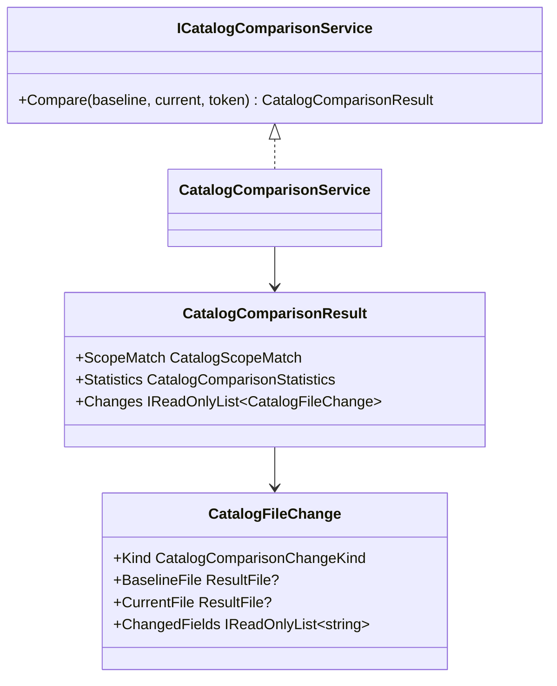

# Specification 044 - Historical Catalog Comparison Service

| Field | Value |
| --- | --- |
| Component | Pure bounded comparison models and application service |
| Target release | v0.9 |
| Depends on | v0.8 `CatalogEntry`, source scope, and `CatalogPathIdentity` |

## Contract

`ICatalogComparisonService.Compare` shall accept distinct or equal loaded entries and a cancellation token without performing I/O. The Desktop rejects equal selections as a user error, while the service remains total and testable for them. Inputs above 2,000 files per side are rejected before allocation of the union.

## Comparison rules

Build a path-identity map per entry after sorting candidate records by ID and stored path. Select the first record for an identity and count every additional record as ignored duplicate input. Build accepted tag sets per opaque file ID from normalized accepted non-deterministic values. Compare the ordinally sorted identity union.

Fields are evaluated in this fixed order: size, last modified, extension, category, classification, duplicate status, planned-operation preview, tags. Changed-field collections, tag collections, and result collections are immutable. Statistics exactly equal the published complete comparison result and include ignored duplicates.

Source scope is Unknown if either entry has no roots, Same if normalized sets are equal independent of order, and Different otherwise.

## Cancellation, capacity, and tests

Observe cancellation before validation, during map/tag construction, and for each union identity. At most 4,000 changes are produced. Tests cover every field and kind, stable sorting, tag normalization, duplicate path handling, Windows/UNC case and separator equivalence, Unix case distinction, scope states, zero files, maximum files, oversize rejection, and cancellation.
