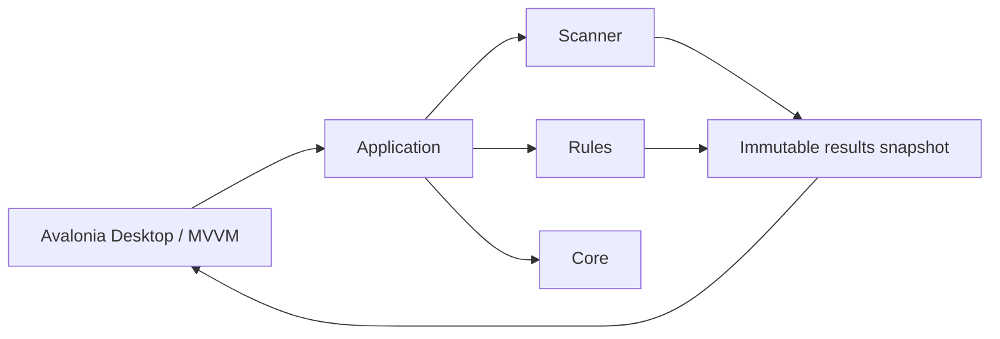

# System Overview

> This document describes the current OpenSorSe implementation and identifies broader architecture material that remains future design intent.

---

## Current product boundary

OpenSorSe is a local-first desktop application for safely analyzing selected folders. The validated v0.2 release is implemented in .NET 8, C#, Avalonia UI, and MVVM.

The Desktop workflow is intentionally read-only. It scans selected folders, enriches file information in memory, and presents review data without renaming, moving, deleting, overwriting, or otherwise modifying selected user files.

The current release does not implement AI, OCR, semantic search, content readers, database-backed result storage, report generation, or plugins.

## Implemented architecture

| Component | Current responsibility |
| --- | --- |
| `OpenSorSe.Core` | Configuration, logging, events, application state, lifecycle, error handling, dependency injection, and task infrastructure. |
| `OpenSorSe.Scanner` | Read-only folder traversal, file discovery, metadata extraction, SHA-256 hashing, deterministic classification, and exact duplicate detection. |
| `OpenSorSe.Rules` | Deterministic rule evaluation, planning, and lexical conflict resolution. |
| `OpenSorSe.Executor` | Execution and undo components retained as infrastructure; they are not exposed by the current Desktop workflow. |
| `OpenSorSe.Application` | Read-only processing orchestration, in-memory session management, application routing, and immutable results snapshots. |
| `OpenSorSe.Desktop` | Avalonia MVVM shell, Dashboard, Scan, Results Explorer, duplicate review, Settings, Diagnostics, Operation History, and notifications. |

## Read-only processing flow

1. The user selects one or more local folders.
2. The Scanner discovers entries and reads filesystem metadata.
3. The pipeline calculates hashes, applies deterministic classification, detects exact duplicates, and evaluates rules.
4. The Application layer produces an in-memory result snapshot for a completed session.
5. The Desktop application presents the Results Explorer and duplicate review.

The current Desktop workflow never invokes the execution or undo components. Result data is process-local and is discarded when the application closes.

## Architecture maturity

The architecture documentation also contains longer-term designs for Readers, AI, Database, Search, Reports, and Plugins. Those sections are future architectural intent and must not be read as implemented v0.2 functionality.

Future work should preserve the current component boundaries and receive its own implementation proposal before changing the read-only safety model.

## Documentation structure

| Section | Status in current release |
| --- | --- |
| `00_System` | Current system guidance and future design context. |
| `01_Core` | Implemented foundation. |
| `02_Scanner` | Implemented read-only analysis pipeline. |
| `03_Readers` | Future design intent. |
| `04_AI` | Future design intent. |
| `05_Database` | Future design intent; current results are not persisted. |
| `06_Search` | Future design intent; current Results Explorer searches one in-memory scan only. |
| `07-Rules` | Implemented deterministic evaluation and planning infrastructure; no Desktop execution workflow. |
| `08_Gui` | Partially implemented; current pages are documented by their v0.1/v0.2 specifications. |
| `09_Reports` | Future design intent. |
| `10_Plugins` | Future design intent. |

## Related documents

- [Release Status](../../RELEASE_STATUS.md)
- [System Goals](01_System_Goals.md)
- [Component Map](03_Component_Map.md)
- [Data Flow](04_Data_Flow.md)
- [Technology Stack](../99_Appendix/Technology_Stack.md)
