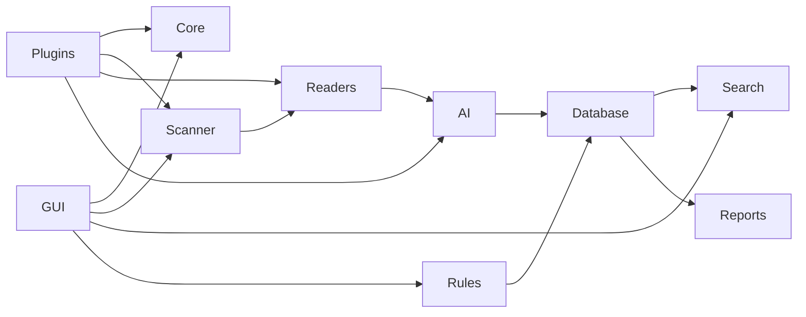

# System Overview

> This document provides a high-level overview of the TidyMind architecture. It introduces the project's purpose, the major architectural components, and the structure of the architecture documentation.

---

## Introduction

TidyMind is a local-first, AI-powered file organization and knowledge management application designed to help users organize, understand, and retrieve information from their digital files.

Rather than replacing the operating system's file manager, TidyMind works alongside it by providing intelligent analysis, semantic understanding, automated organization, and powerful search capabilities while ensuring that the user remains in complete control of their data.

The architecture has been designed with modularity, maintainability, and extensibility as primary goals. Each subsystem has a clearly defined responsibility and communicates with other subsystems through well-defined interfaces.

---

## Purpose of the Architecture

The purpose of this architecture documentation is to define how TidyMind is structured, how its components interact, and the responsibilities of each subsystem.

This documentation serves as the primary technical reference for:

* Project contributors
* Future maintainers
* AI-assisted development tools
* Plugin developers

It is intended to provide a clear understanding of the system before implementation details are considered.

---

## Architectural Overview

TidyMind is divided into a collection of independent but cooperating subsystems.

Each subsystem focuses on a single area of responsibility while remaining loosely coupled to the rest of the application.

The major architectural subsystems are:

| Subsystem | Responsibility                                                                               |
| --------- | -------------------------------------------------------------------------------------------- |
| Core      | Provides shared application infrastructure and services used throughout the system.          |
| Scanner   | Discovers files, folders, and collects filesystem metadata.                                  |
| Readers   | Extracts readable content from supported file formats.                                       |
| AI        | Performs document understanding, classification, summarization, and intelligent suggestions. |
| Database  | Stores metadata, application settings, history, caches, and search information.              |
| Search    | Enables keyword and semantic search across indexed files.                                    |
| Rules     | Executes user-defined automation based on configurable conditions and actions.               |
| GUI       | Provides the graphical interface through which users interact with the application.          |
| Reports   | Generates statistics, summaries, and system reports.                                         |
| Plugins   | Allows additional functionality to be integrated without modifying the core application.     |

Each subsystem is documented in its own section of the architecture.

---

## High-Level Component Diagram

---

## Design Philosophy

The architecture follows several guiding principles:

* **Modularity** — Each subsystem has a clearly defined responsibility.
* **Separation of Concerns** — Components perform one primary function and avoid unnecessary dependencies.
* **Local-First** — Core functionality should operate without requiring cloud services.
* **Privacy** — User data remains under the user's control.
* **Extensibility** — New functionality should be added with minimal impact on existing components.
* **Maintainability** — The architecture should remain understandable and scalable as the project grows.

These principles are described in greater detail in the **Design Principles** document.

---

## Architecture Documentation Structure

The architecture documentation is organized into the following sections:

| Section     | Description                                                    |
| ----------- | -------------------------------------------------------------- |
| 00_System   | High-level system architecture and design.                     |
| 01_Core     | Shared application infrastructure and services.                |
| 02_Scanner  | File discovery and scanning pipeline.                          |
| 03_Readers  | File content extraction for supported formats.                 |
| 04_AI       | Artificial intelligence components and document understanding. |
| 05_Database | Persistent storage, caching, and application data.             |
| 06_Search   | Keyword, semantic search, filtering, and indexing.             |
| 07_Rules    | Automation and rule execution engine.                          |
| 08_GUI      | User interface architecture and application screens.           |
| 09_Reports  | Reporting and analytics subsystem.                             |
| 10_Plugins  | Plugin architecture and extension system.                      |
| 99_Appendix | Supporting documentation, standards, and reference material.   |

---

## Reading Order

For readers who are new to the project, the recommended reading order is:

1. System Overview
2. System Goals
3. Design Principles
4. Component Map
5. Data Flow
6. Event Flow
7. User Flow
8. Deployment

After understanding the system architecture, readers can continue with the documentation for each individual subsystem.

---

## Related Documents

* [System Goals](01_System_Goals.md)
* [Design Principles](02_Design_Principles.md)
* [Component Map](03_Component_Map.md)
* [Data Flow](04_Data_Flow.md)
* [Event Flow](05_Event_Flow.md)
* [User Flow](06_User_Flow.md)
* [Deployment](07_Deployment.md)
