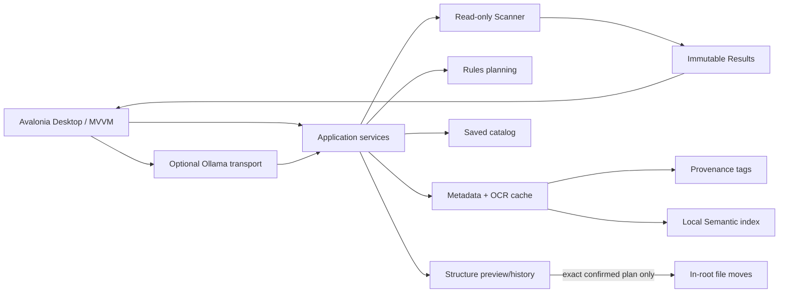

# OpenSorSe 1.0 System Overview

OpenSorSe is a local-first Avalonia desktop application for understanding selected folders and reviewing organization decisions. It uses .NET 8, C#, MVVM, dependency injection, bounded asynchronous work, and versioned local JSON stores.

## Product boundary

Scanning, exact-duplicate review, metadata extraction, OCR Beta, tag generation, Semantic Search Beta, catalog/history comparison, diagrams, and optional AI suggestions are non-mutating. AI is disabled by default, metadata-only, untrusted, and suggestion-only.

OpenSorSe 1.0 adds one narrow mutation boundary: a deterministic folder-restructuring proposal can be applied only after a second exact-preview confirmation. The service revalidates the unchanged explicit root, rejects traversal/reparse/conflict/overwrite/missing-source cases, moves at most 500 listed files, attempts rollback on interruption, and persists outcomes. It does not consume AI output.

## Implemented components

| Project | Responsibility |
| --- | --- |
| `OpenSorSe.Core` | Validated settings, logging, lifecycle, events, state, tasks, and dependency-injection support. |
| `OpenSorSe.Scanner` | Read-only traversal, filesystem metadata, hashing, deterministic classification, and exact duplicate detection. |
| `OpenSorSe.Rules` | Deterministic rule evaluation/planning and conflict resolution; no Desktop execution workflow. |
| `OpenSorSe.Executor` | Historical generic executor/undo library retained for tests; not registered by the Desktop. |
| `OpenSorSe.Application` | Processing orchestration, Results projection, AI gates/contracts, catalog/search/comparison, content extraction, OCR service, provenance tags, semantic index/search, and restructuring/history/comparison. |
| `OpenSorSe.AI` | Optional Ollama-compatible HTTP transport and bounded AI review-decision persistence. |
| `OpenSorSe.Desktop` | Avalonia shell, global feature controls, MVVM pages, preview/review workflows, Help, diagnostics, and explicit restructuring confirmation. |

## Local stores

Settings, logs, AI decisions, saved catalog/searches, extracted content, semantic index, and structure history live in separate bounded OpenSorSe application-data files. Missing optional stores are valid empty states. Corrupt optional caches/index/history fail closed and cannot activate a file operation.

## Deferred

Plugins, broad localization, installers/release automation, cloud indexing, live monitoring, report export, autonomous AI actions, learned/external embedding models, bundled PDF rasterization, and generic rule execution remain post-1.0 work.

## Related documents

- [Component Map](03_Component_Map.md)
- [Data Flow](04_Data_Flow.md)
- [User Flow](06_User_Flow.md)
- [Safety and Privacy](../../SAFETY_AND_PRIVACY.md)
- [v1.0 specification](../../Implementation_Spec/v1.0/048_v1.0_Integrated_Release.md)
