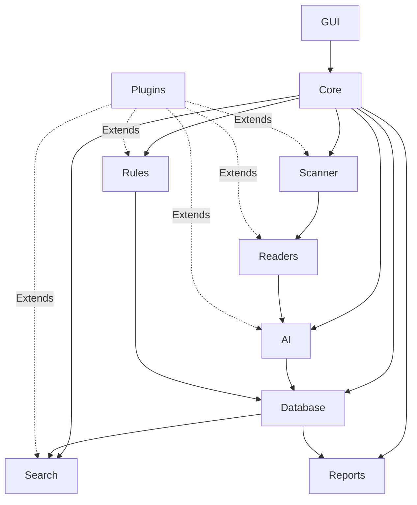

# Component Map

> This document provides a high-level view of the major architectural components that make up TidyMind and illustrates how they interact with one another.

---

## Purpose

The Component Map defines the primary subsystems of TidyMind and their relationships.

Its purpose is to provide contributors with a clear understanding of the overall architecture before exploring the implementation details of individual modules.

This document focuses on component responsibilities and dependencies rather than implementation.

---

# Architectural Overview

TidyMind is organized as a collection of independent subsystems.

Each subsystem has a clearly defined responsibility and communicates with other subsystems through well-defined interfaces.

This modular approach improves maintainability, scalability, and extensibility.

---

# High-Level Component Diagram



---

# Component Responsibilities

| Component | Responsibility                                                                                             |
| --------- | ---------------------------------------------------------------------------------------------------------- |
| Core      | Provides shared infrastructure, configuration, logging, events, application state, and common services.    |
| Scanner   | Discovers files, folders, and filesystem changes.                                                          |
| Readers   | Extracts metadata and content from supported file formats.                                                 |
| AI        | Performs document understanding, classification, summarization, renaming, and intelligent recommendations. |
| Database  | Stores application data, metadata, settings, history, and caches.                                          |
| Search    | Provides keyword and semantic search across indexed content.                                               |
| Rules     | Executes user-defined automation based on configurable conditions and actions.                             |
| GUI       | Presents the application's user interface and coordinates user interactions.                               |
| Reports   | Generates statistics, summaries, and analytical reports.                                                   |
| Plugins   | Extends existing functionality without modifying the core application.                                     |

---

# Dependency Overview

The architecture intentionally minimizes coupling between subsystems.

General dependency direction follows the pattern:

```text
GUI
│
▼
Core
│
├── Scanner
├── AI
├── Database
├── Search
├── Rules
└── Reports

Scanner
│
▼
Readers
│
▼
AI
│
▼
Database
│
├── Search
└── Reports
```

Subsystems should communicate through well-defined interfaces rather than relying on implementation details.

---

# Architectural Characteristics

The component architecture has been designed with the following characteristics:

* Modular
* Loosely coupled
* Highly cohesive
* Extensible
* Testable
* Maintainable
* Local-first
* Platform independent

Each subsystem is responsible for a specific area of functionality and should avoid overlapping responsibilities.

---

# Extension Points

The architecture has been designed to support future expansion.

Examples include:

* Additional file readers
* New AI model providers
* Alternative search engines
* Custom automation rules
* New reporting modules
* Third-party plugins

New functionality should integrate through existing extension points wherever possible instead of modifying unrelated components.

---

# Related Documents

* [System Overview](00_Overview.md)
* [Design Principles](02_Design_Principles.md)
* [Data Flow](04_Data_Flow.md)
