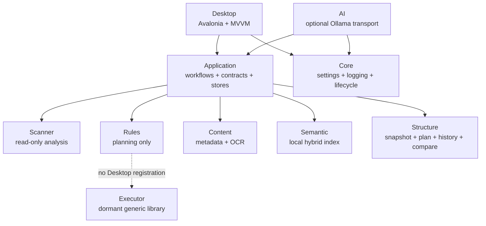

# OpenSorSe 1.0 Component Map

| Boundary | Enforcement |
| --- | --- |
| Feature visibility | `FeatureRequirement` and `FeatureAccess` combine AI, Advanced, and Semantic settings for navigation and commands. |
| AI | `IAiSuggestionService` checks global/capability/provider/context state before `IAiSuggestionProvider`; structured parsers/validators reject unsafe output. |
| Content | Extractors and OCR use read-only, bounded, cancellable requests; `IContentStore` is independent of source files. |
| Semantic | `ISemanticIndexer` and `ISemanticSearchService` use a local deterministic provider and versioned index store; disabled calls do no store/provider work. |
| Structure | `IFolderRestructuringService` separates preview from exact confirmation and uses `IFolderStructureSnapshotService` plus `IStructureHistoryStore`. |
| UI | ViewModels own asynchronous state/commands; views contain layout and bindings, not filesystem business logic. |
| Generic execution | `IActionExecutor`/`IUndoEngine` are not registered in the Desktop composition root. |

The production service provider validates every registration in automated tests.
