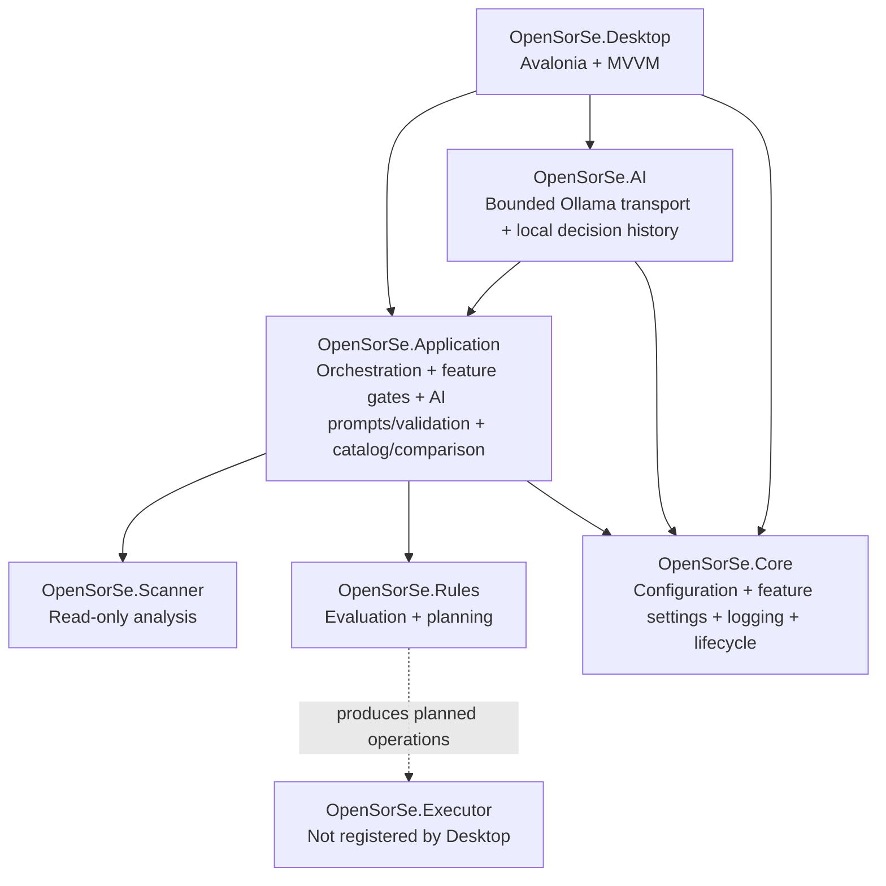

# Component Map

> The map below reflects the implemented v0.9.1 component relationships. Longer-term components are listed separately as future design intent.

---

## Implemented components

| Component | Implemented responsibility | Current safety boundary |
| --- | --- | --- |
| Desktop | Presents regular and advanced scan/review workflows plus capability-specific AI proposal panels. | Central visibility requirements and command gates; contains no selected-user-file operation control. |
| Application | Coordinates processing, immutable results, central feature access, bounded prompts, strict AI response validation, catalog snapshots/queries, and stored-metadata comparison. | Rejects disabled/unsafe AI requests before transport; no AI result flows to an operation API. |
| AI | Implements optional bounded Ollama transport and local decision-history persistence behind application-owned contracts. | Does not expose transport DTOs to Desktop and cannot mutate files. |
| Scanner | Traverses selected folders, reads metadata, hashes files, classifies deterministically, and detects exact duplicates. | Read-only filesystem access. |
| Rules | Evaluates supplied rules and produces display-only plans and conflict resolution. | Does not execute plans. |
| Core | Provides shared infrastructure and local application configuration/logging support. | Does not create a user-file mutation path. |
| Executor | Contains execution and undo infrastructure from the foundation work. | Not registered, invoked, or surfaced by the validated Desktop workflow. |

## Future design areas

Readers, the broader Database subsystem, Reports, and Plugins remain future architectural design areas. Search and AI have only the narrow capabilities documented through v0.9.1: deterministic metadata search, bounded historical comparison, and two optional constrained Ollama suggestion types. They are not live-monitoring, content-reader, report-export, persistent-index, semantic-search, agent, or plugin implementations.

As of v0.9, bounded comparison is an implemented Application service over two loaded catalog entries. It is not live monitoring, a report-export subsystem, a database index, or semantic search.

Future additions should use the implemented boundaries above rather than bypassing the Application layer or coupling UI code directly to scanner models.

## Related documents

- [System Overview](00_Overview.md)
- [Data Flow](04_Data_Flow.md)
- [Release Status](../../RELEASE_STATUS.md)
