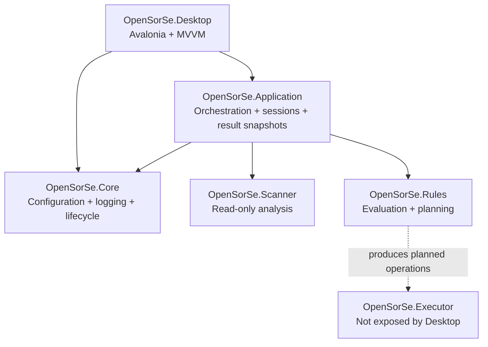

# Component Map

> The map below reflects the implemented v0.2 component relationships. Longer-term components are listed separately as future design intent.

---

## Implemented components

| Component | Implemented responsibility | Current safety boundary |
| --- | --- | --- |
| Desktop | Presents scan and review workflows, including Results Explorer and exact-duplicate review. | Contains no file-operation control. |
| Application | Coordinates the completed processing pipeline and projects immutable in-memory results. | Does not persist results or access files outside the scanner pipeline. |
| Scanner | Traverses selected folders, reads metadata, hashes files, classifies deterministically, and detects exact duplicates. | Read-only filesystem access. |
| Rules | Evaluates supplied rules and produces display-only plans and conflict resolution. | Does not execute plans. |
| Core | Provides shared infrastructure and local application configuration/logging support. | Does not create a user-file mutation path. |
| Executor | Contains execution and undo infrastructure from the foundation work. | Not invoked or surfaced by the validated Desktop workflow. |

## Future design areas

Readers, AI, Database, Search, Reports, and Plugins remain architectural design areas. They are not projects or user-visible capabilities in the current v0.2 release.

Future additions should use the implemented boundaries above rather than bypassing the Application layer or coupling UI code directly to scanner models.

## Related documents

- [System Overview](00_Overview.md)
- [Data Flow](04_Data_Flow.md)
- [Release Status](../../RELEASE_STATUS.md)
