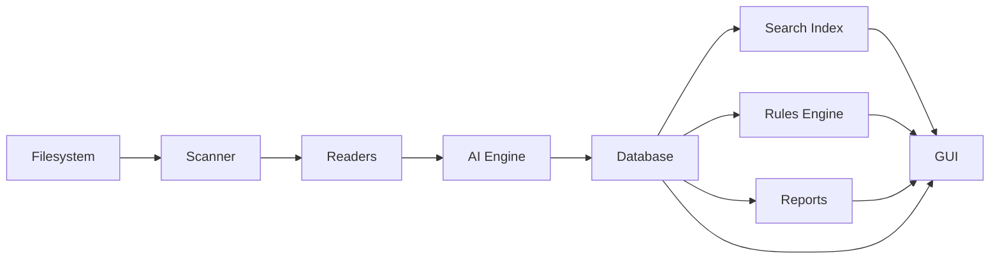

# Data Flow

> This document describes how data moves through OpenSorSe, from initial file discovery to storage, indexing, and presentation.

---

## Purpose

The purpose of this document is to describe the lifecycle of data within OpenSorSe.

Understanding the flow of data between subsystems helps contributors understand component responsibilities, dependencies, and processing order.

This document focuses on **what data moves** and **where it flows**, rather than how individual components are implemented.

---

# Data Flow Overview

The following diagram illustrates the primary flow of information through the system.

---

# Processing Pipeline

A typical file progresses through the following stages:

| Stage               | Description                                                   |
| ------------------- | ------------------------------------------------------------- |
| File Discovery      | The Scanner locates files within the selected directories.    |
| Metadata Collection | Filesystem metadata is collected.                             |
| Content Extraction  | Readers extract readable content from supported file formats. |
| AI Processing       | The AI subsystem analyzes and enriches extracted information. |
| Database Storage    | Metadata, AI results, and processing history are stored.      |
| Search Indexing     | Search indexes are updated.                                   |
| Rule Evaluation     | User-defined automation rules are evaluated.                  |
| Presentation        | Results become available through the graphical interface.     |

---

# Data Types

Several different types of data flow through the application.

| Data Type        | Produced By      | Consumed By       |
| ---------------- | ---------------- | ----------------- |
| File Information | Scanner          | Readers, Database |
| Metadata         | Scanner, Readers | AI, Database      |
| Document Content | Readers          | AI                |
| AI Results       | AI               | Database, Rules   |
| Search Index     | Database         | Search            |
| Search Results   | Search           | GUI               |
| Reports          | Reports          | GUI               |
| User Settings    | GUI              | Core, Database    |
| Rules            | GUI              | Rules Engine      |

---

# Data Ownership

Each subsystem owns the data it produces.

| Subsystem | Primary Responsibility |
| --------- | ---------------------- |
| Scanner   | File discovery         |
| Readers   | Content extraction     |
| AI        | Document understanding |
| Database  | Persistent storage     |
| Search    | Search indexes         |
| Rules     | Automation execution   |
| Reports   | Generated statistics   |
| GUI       | User interaction       |

Ownership helps maintain clear architectural boundaries and reduces unnecessary coupling between components.

---

# Data Persistence

Not all information generated during processing is permanently stored.

Examples of persistent data include:

* Application settings
* File metadata
* AI classifications
* Search indexes
* Processing history
* User-defined rules
* Cached embeddings

Temporary processing data should remain in memory only for the duration of the operation unless explicitly required elsewhere.

---

# Design Considerations

The data flow architecture is designed to achieve the following objectives:

* Minimize redundant processing.
* Maintain clear ownership of data.
* Reduce unnecessary dependencies.
* Enable efficient indexing and searching.
* Support asynchronous processing.
* Allow future expansion without redesigning the pipeline.

---

# Related Documents

* [Component Map](03_Component_Map.md)
* [Event Flow](05_Event_Flow.md)
* [Database Overview](../05_Database/00_Overview.md)
* [Search Overview](../06_Search/00_Overview.md)
