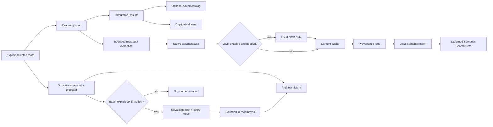

# OpenSorSe 1.0 Data Flow

## Ownership and lifetime

| Data | Lifetime |
| --- | --- |
| Scan entries, hashes, duplicates, rule plans, current Results filters | In memory for the current processing/results context. |
| Saved snapshots, accepted catalog tags, names/source scope | Optional bounded `catalog.json`. |
| Saved query definitions | Bounded `saved-catalog-searches.json`; hits remain in memory. |
| Extracted metadata/native/OCR text and generated tag state | Bounded local `content-index.json`, invalidated by source fingerprint. |
| Semantic terms/vectors | Bounded rebuildable `semantic-index.json`. |
| AI review decisions | Bounded metadata-only `decision-history.json`. |
| Structure source/proposed/applied snapshots and outcomes | Bounded `structure-history.json`; file contents are not stored. |
| Comparison rows, diagram filters, current structure capture | In memory and capped for presentation. |

## Failure isolation

Malformed documents, OCR unavailability, semantic-index corruption, AI provider failure, catalog I/O, and structure-history corruption return controlled states and do not break scanning or unrelated workflows. Only a validated, separately confirmed restructuring apply can reach `File.Move`; every other flow is read-only with respect to source files.
