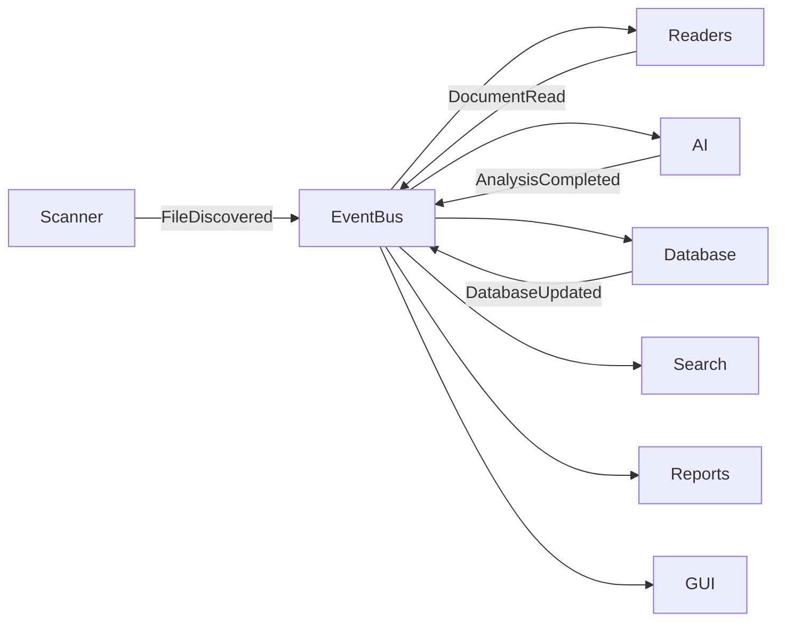

# Event Flow

> This document describes how components communicate within TidyMind using an event-driven architecture.

---

## Purpose

The purpose of the Event Flow architecture is to enable communication between subsystems while minimizing direct dependencies.

Instead of components calling one another directly, they communicate by publishing and subscribing to events through the application's Event Bus.

This approach improves modularity, scalability, and maintainability.

---

# Event-Driven Architecture

TidyMind follows an event-driven architecture for communication between major subsystems.

When a component completes an operation or detects a significant change, it publishes an event.

Interested components subscribe to relevant events and respond accordingly.

This allows components to remain independent while still cooperating to perform complex workflows.

---

# High-Level Event Flow

---

# Event Lifecycle

A typical event follows this sequence:

1. A component performs an operation.
2. The component publishes an event.
3. The Event Bus receives the event.
4. Interested components receive the event.
5. Each subscriber performs its own processing.
6. Additional events may be generated as processing continues.

Components are unaware of which other components receive their events.

---

# Typical Workflow

The following example illustrates a simplified processing workflow.

| Step                                | Event                |
| ----------------------------------- | -------------------- |
| Scanner discovers a file            | `FileDiscovered`     |
| Reader extracts document content    | `DocumentRead`       |
| AI completes analysis               | `AnalysisCompleted`  |
| Database stores results             | `DatabaseUpdated`    |
| Search index refreshes              | `SearchIndexUpdated` |
| GUI refreshes displayed information | `ViewUpdated`        |

These event names are illustrative and may evolve as the implementation develops.

---

# Event Bus Responsibilities

The Event Bus is responsible for:

* Receiving published events.
* Delivering events to subscribers.
* Maintaining loose coupling between components.
* Supporting multiple subscribers for the same event.
* Ensuring predictable event propagation.

The Event Bus does **not** contain business logic.

Its sole responsibility is communication.

---

# Benefits

Using an event-driven architecture provides several advantages:

* Reduced coupling between subsystems.
* Improved scalability.
* Easier testing.
* Simplified feature expansion.
* Better support for asynchronous processing.
* Improved plugin integration.

New components can subscribe to existing events without modifying the components that publish them.

---

# Design Considerations

Events should represent meaningful occurrences within the system.

Examples include:

* File discovered
* Scan completed
* Document processed
* AI analysis finished
* Database updated
* Rule executed
* Search completed
* Plugin loaded

Events should communicate **what happened**, not **what another component should do**.

---

# Related Documents

* [Data Flow](04_Data_Flow.md)
* [Core Overview](../01_Core/00_Overview.md)
* [Event Bus](../01_Core/04_Event_Bus.md)
