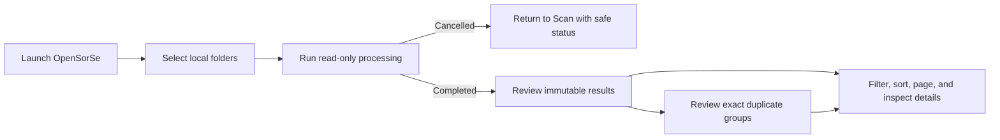

# User Flow

> This document describes the validated v0.2 read-only user workflow.

---

## Primary workflow

## User actions available today

| Action | Behavior |
| --- | --- |
| Scan | Select one or more local folders and start a read-only analysis pipeline. |
| Cancel | Request cancellation of active processing; incomplete results are not presented as completed review data. |
| Review results | Filter, sort, page, and inspect the in-memory output of a completed scan. |
| Review duplicates | Inspect existing exact SHA-256 groups and return to their result rows. |
| Configure | Update implemented application settings. |
| Diagnose | Review aggregate diagnostic information. |
| View history | Review available in-memory operation-history state without performing operations. |

## Safety boundary

Users cannot rename, move, delete, overwrite, open, reveal, execute, or undo files through the validated Desktop workflow. Planned operations are informational only.

AI suggestions, OCR, semantic search, content readers, result persistence, reports, and automatic organization are not part of the current user flow.

## Related documents

- [System Overview](00_Overview.md)
- [GUI Overview](../08_Gui/00_Overview.md)
- [Release Status](../../RELEASE_STATUS.md)
