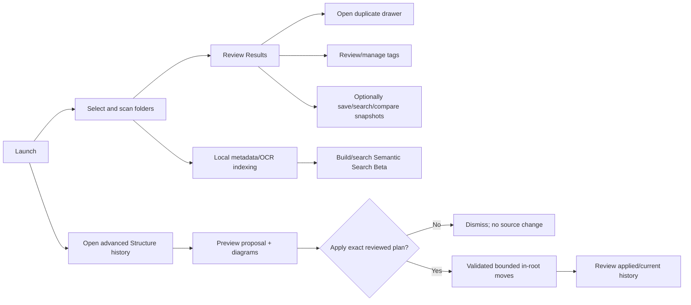

# OpenSorSe 1.0 User Flow

## Primary actions

| Action | Effect |
| --- | --- |
| Scan/cancel | Reads selected roots asynchronously; never modifies them. |
| Results/search/filter/tags | Changes view state or OpenSorSe-owned tag metadata only. |
| Duplicate drawer/open | Reviews exact groups and asks the OS to open capped known paths; never deletes. |
| Catalog/search/comparison | Reads/writes bounded OpenSorSe-owned historical metadata only. |
| OCR/metadata | Locally reads supported files under bounds; source files remain unchanged. |
| Semantic build/search/clear | Writes or removes only the local rebuildable semantic index. |
| AI generate/review | Sends bounded metadata only after explicit enablement; accept/edit/reject remains a local decision. |
| Structure preview/diagram/current capture | Reads metadata and writes preview history only. |
| Structure apply | After a separate exact confirmation, moves only listed files under one root after full revalidation. |
| Clear structure history | Removes only OpenSorSe history; does not undo or modify files. |

Global AI and Advanced switches remain visible from every page. Disabling a switch hides affected pages and safely returns stale hidden navigation to Dashboard without resetting saved dependent values.
