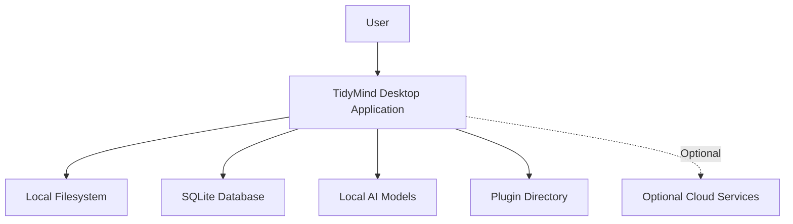

# Deployment

> This document describes the runtime deployment architecture of TidyMind, including the major runtime components, local storage, optional external services, and the overall execution environment.

---

## Purpose

The purpose of this document is to define how TidyMind is deployed and executed.

Unlike the logical architecture described in previous documents, this document focuses on the physical arrangement of application components during runtime.

The deployment architecture is designed around a **local-first** philosophy where all core functionality operates directly on the user's machine.

---

# Deployment Overview

TidyMind is deployed as a desktop application.

All primary components execute locally and communicate internally through the application's architecture.

No internet connection is required for core functionality.

Optional external services may be integrated, but they are not required for normal operation.

---

# Deployment Diagram

---

# Runtime Components

The deployed application consists of the following runtime components.

| Component               | Description                                                  |
| ----------------------- | ------------------------------------------------------------ |
| Desktop Application     | Hosts the user interface and application logic.              |
| Local Filesystem        | Source of files and folders managed by TidyMind.             |
| SQLite Database         | Stores metadata, settings, history, indexes, and caches.     |
| Local AI Models         | Perform document understanding and AI-assisted features.     |
| Plugin Directory        | Contains user-installed plugins that extend the application. |
| Optional Cloud Services | External services that users may choose to enable.           |

---

# Local Storage

Application data is stored locally.

Typical stored information includes:

* Application settings
* User preferences
* Metadata
* Search indexes
* AI-generated information
* Processing history
* Cached data
* Plugin configuration

The exact storage locations are platform-dependent and are documented separately.

---

# Optional External Services

Although TidyMind is designed to operate completely offline, optional integrations may be supported.

Examples include:

* Cloud-based AI providers
* Cloud storage providers
* Future synchronization services

These integrations should always be optional and require explicit user configuration.

Core functionality must remain available without them.

---

# Deployment Principles

The deployment architecture follows several important principles:

* Local-first execution
* Offline operation
* Minimal external dependencies
* User ownership of data
* Simple installation
* Cross-platform compatibility
* Modular runtime components

These principles ensure that users retain full control over their files and data.

---

# Scalability

The deployment architecture should support:

* Small personal file collections
* Large document libraries
* Multiple storage locations
* Large AI models
* Additional plugins
* Future architectural expansion

Scalability should be achieved without significantly increasing deployment complexity.

---

# Future Considerations

The architecture should allow future support for additional deployment scenarios without affecting the core design.

Examples include:

* Portable installations
* Enterprise deployments
* Shared configuration profiles
* Remote AI inference
* Network-attached storage (NAS)
* Distributed indexing

These deployment models should extend the architecture rather than replace the existing local-first approach.

---

# Related Documents

* [System Overview](00_Overview.md)
* [Configuration](../01_Core/02_Configuration.md)
* [Database Overview](../05_Database/00_Overview.md)
* [Plugin Overview](../10_Plugins/00_Overview.md)
