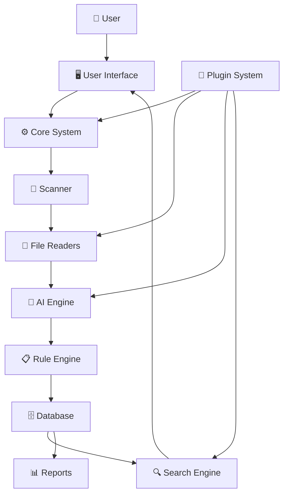
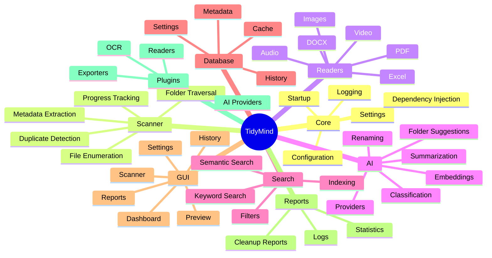

# TidyMind System Overview

# TidyMind System Overview

This diagram represents the highest level architecture of TidyMind.

Every major subsystem is shown here.

Each subsystem will later receive its own architecture document.

---

## Responsibilities

### Core

Coordinates every subsystem.

---

### Scanner

Discovers folders and files.

---

### Readers

Extracts information from supported file types.

---

### AI

Understands document contents.

Generates summaries.

Suggests filenames.

Suggests folder structures.

---

### Rule Engine

Applies user-defined rules.

---

### Database

Stores metadata, history, settings and cached AI results.

---

### Search

Provides keyword and semantic search.

---

### Reports

Generates cleanup statistics and reports.

---

### GUI

Displays information to the user.

Allows interaction with every subsystem.

---

### Plugins

Allows extension of TidyMind without modifying the core application.

