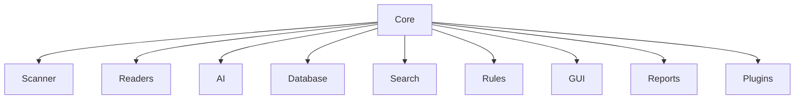

# Core Overview

> This document provides an overview of the Core subsystem, which serves as the foundation of the OpenSorSe application. The Core provides shared infrastructure, common services, application lifecycle management, and communication mechanisms used throughout the system.

---

## Implementation Status

`OpenSorSe.Core` supplies the current domain models and shared abstractions used by the .NET 8 application. `OpenSorSe.Application` and the Desktop composition root provide the current lifecycle, dependency-injection, settings, diagnostics, and operation-history integration around those models.

The wider dependency diagram and the detailed documents in this section describe a long-term architectural vocabulary. OpenSorSe 1.0 implements the bounded local content pipeline, optional image OCR adapter, provenance-aware tags, deterministic Semantic Search Beta, optional constrained AI, schema-compatible JSON stores, and deterministic structure-history workflow identified in the current release specification. A relational database, reports, plugins, broad localization, cloud indexing, and general-purpose automation remain future design. See the [System Overview](../00_System/00_Overview.md) for the active component map.

---

## Purpose

The Core subsystem provides the fundamental services required by every other subsystem within OpenSorSe.

Rather than implementing application features, the Core establishes the infrastructure that enables the rest of the application to operate consistently and reliably.

Every major subsystem depends on the Core, while the Core itself remains independent of higher-level application features.

---

# Responsibilities

The Core subsystem is responsible for:

* Application startup and shutdown
* Global configuration management
* Logging
* Event-based communication
* Service registration and discovery
* Global application state
* Background task management
* Shared utilities
* Common error handling

These responsibilities provide a consistent foundation for the remainder of the application.

---

# Architectural Overview

The Core sits at the center of the application architecture and provides shared services to all major subsystems.

---

# Core Components

The Core subsystem consists of several infrastructure components.

| Component         | Responsibility                                                    |
| ----------------- | ----------------------------------------------------------------- |
| Application       | Controls application startup, shutdown, and lifecycle.            |
| Configuration     | Loads and manages application settings.                           |
| Logging           | Provides centralized logging services.                            |
| Event Bus         | Enables communication between subsystems.                         |
| Service Registry  | Manages shared services and dependency resolution.                |
| Application State | Maintains global runtime state.                                   |
| Task Manager      | Executes and monitors background tasks.                           |
| Utilities         | Provides shared helper functions used throughout the application. |
| Error Handling    | Defines common error reporting and recovery mechanisms.           |

Each component is documented individually within this section.

---

# Design Principles

The Core subsystem follows several architectural principles.

### Independent

The Core should not depend on higher-level application modules.

Dependencies should always point toward the Core rather than away from it.

---

### Reusable

Core services should be generic enough to support any subsystem without modification.

---

### Lightweight

The Core should contain only infrastructure.

Business logic belongs in feature-specific modules.

---

### Consistent

Shared functionality should be implemented once within the Core rather than duplicated across multiple subsystems.

---

### Extensible

New infrastructure services should integrate naturally into the Core without requiring major architectural changes.

---

# Responsibilities of Other Subsystems

The Core deliberately does **not** implement business functionality.

The following responsibilities belong elsewhere:

| Responsibility    | Subsystem |
| ----------------- | --------- |
| File discovery    | Scanner   |
| Document reading  | Readers   |
| AI processing     | AI        |
| Search indexing   | Search    |
| Database storage  | Database  |
| User interface    | GUI       |
| Report generation | Reports   |

Maintaining this separation helps preserve a clean architecture.

---

# Dependency Rule

The Core forms the lowest architectural layer of the application.

Higher-level subsystems may depend on the Core.

The Core must **never** depend on feature-specific subsystems.

This dependency rule helps prevent circular dependencies and maintains a stable architectural foundation.

---

# Related Documents

* [Application](01_Application.md)
* [Configuration](02_Configuration.md)
* [Logging](03_Logging.md)
* [Event Bus](04_Event_Bus.md)
* [Service Registry](05_Service_Registry.md)
* [Application State](06_Application_State.md)
* [Task Manager](07_Task_Manager.md)
* [Utilities](08_Utilities.md)
* [Error Handling](09_Error_Handling.md)
