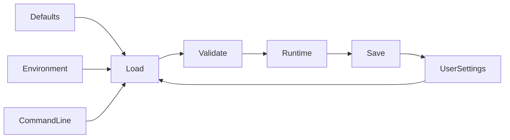

# Configuration

> This document defines the configuration architecture of OpenSorSe, including how application settings are organized, loaded, accessed, validated, and persisted.

---

## Purpose

The Configuration component provides a centralized mechanism for managing application settings.

It is responsible for loading configuration during application startup, validating configuration values, providing access to settings throughout the application, and persisting user changes when necessary.

The Configuration component acts as the single source of truth for application configuration.

---

# Responsibilities

The Configuration component is responsible for:

* Loading configuration data.
* Validating configuration values.
* Providing read access to configuration.
* Managing user preferences.
* Persisting configuration changes.
* Providing default values.
* Supporting future configuration migration.

---

# Scope

### In Scope

* Application settings
* User preferences
* Default values
* Configuration validation
* Runtime configuration access
* Configuration persistence

### Out of Scope

The Configuration component is **not** responsible for:

* Application state
* Cached runtime data
* Database records
* File metadata
* Search indexes
* Processing history

These belong to their respective components.

---

# Configuration Sources

Configuration may originate from multiple sources.

Typical sources include:

* Default application settings
* User configuration
* Environment variables
* Command-line arguments
* Future plugin configuration

When multiple sources define the same setting, a deterministic precedence order should be applied.

---

# Configuration Categories

Configuration is organized into logical groups.

| Category | Examples                                       |
| -------- | ---------------------------------------------- |
| General  | Language, startup behavior, updates            |
| Scanner  | Scan locations, exclusions, limits             |
| AI       | Providers, models, prompts, inference settings |
| Database | Storage location, maintenance settings         |
| Search   | Indexing behavior, search preferences          |
| Rules    | Automation defaults                            |
| GUI      | Theme, layout, notifications                   |
| Plugins  | Installed plugins and plugin settings          |
| Logging  | Log level, output options                      |

Organizing settings by category improves readability and maintainability.

---

# Configuration Lifecycle

---

# Design Principles

The Configuration component should follow these principles:

* Single source of truth
* Predictable behavior
* Strong validation
* Backward compatibility where practical
* Clear organization
* Easy extensibility
* Safe default values

Configuration should remain deterministic and easy to understand.

---

# Validation

Configuration values should be validated before they are made available to the rest of the application.

Validation should ensure:

* Required values are present.
* Values have the correct type.
* Numeric values fall within valid ranges.
* Referenced resources are valid where appropriate.
* Invalid values are reported clearly.

Invalid configuration should never result in undefined application behavior.

---

# Runtime Access

Application components should access configuration through the Configuration component rather than reading configuration files directly.

This provides:

* Consistent access
* Centralized validation
* Easier testing
* Reduced duplication
* Future flexibility

---

# Future Considerations

The architecture should support future enhancements, including:

* Configuration versioning
* Migration between schema versions
* Import and export of settings
* Multiple configuration profiles
* Workspace-specific settings
* Plugin-defined configuration sections

These capabilities should be introduced without changing the public configuration interface.

---

# Related Documents

* [Application](01_Application.md)
* [Application State](06_Application_State.md)
* [Database Overview](../05_Database/00_Overview.md)
