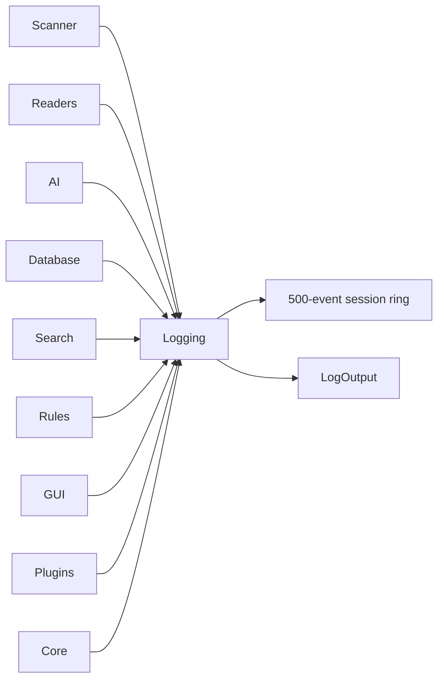

# Logging

> This document defines the logging architecture used throughout OpenSorSe.

## Implementation status

OpenSorSe 0.9.1 implements centralized `Microsoft.Extensions.Logging` categories, process-lifetime severity statistics, Debug output, a newest-first 500-event in-memory diagnostic ring, and optional local UTF-8 daily files. Diagnostic events contain UTC time, severity, category, bounded summary, optional event ID, and a safe bounded exception summary; stack traces are not projected into the normal UI. Detailed logging controls and the Diagnostics page are advanced, but existing settings remain preserved while hidden. Managed files are named `opensorse-owned-YYYY-MM-DD.log`, begin with an ownership marker, stop accepting entries at 10 MiB per UTC day, and are retained only when both marker and exact daily name match. A custom absolute log directory is supported; an unowned filename collision is preserved and disables the file sink for that process. Remote logging, telemetry, analytics, persistent structured event storage, and log export are not implemented.

---

## Purpose

The Logging component provides a centralized mechanism for recording application events, diagnostic information, warnings, and errors.

Its primary purpose is to assist developers, contributors, and users in understanding application behavior, troubleshooting problems, and diagnosing unexpected conditions.

Logging should be consistent, structured, and available throughout the entire application.

---

# Responsibilities

The Logging component is responsible for:

* Recording application events.
* Recording warnings and errors.
* Recording startup and shutdown information.
* Providing diagnostic information.
* Supporting debugging and troubleshooting.
* Providing configurable logging levels.
* Managing log output destinations.

---

# Scope

### In Scope

* Application logs
* Diagnostic messages
* Warning messages
* Error messages
* Startup and shutdown logs
* Background task logging
* Module logging

### Out of Scope

The Logging component is **not** responsible for:

* Error handling
* User notifications
* Analytics
* Usage tracking
* Application history

These responsibilities belong to other components.

---

# Logging Architecture

Every subsystem writes log messages through the centralized Logging component.

The Logging component provides a common interface for all application modules.

Subsystems should never write directly to log files or other logging destinations.

---

# Logging Levels

The logging system should support multiple severity levels.

| Level       | Purpose                                                       |
| ----------- | ------------------------------------------------------------- |
| Trace       | Detailed diagnostic information for development.              |
| Debug       | Information useful during debugging.                          |
| Information | General application events.                                   |
| Warning     | Recoverable problems or unexpected conditions.                |
| Error       | Operations that failed but allow the application to continue. |
| Critical    | Serious failures that may require application shutdown.       |

Applications may choose to enable or disable logging levels depending on the runtime environment.

---

# Log Categories

Logs should be grouped by subsystem.

Examples include:

* Core
* Scanner
* Readers
* AI
* Database
* Search
* Rules
* GUI
* Reports
* Plugins

Categorizing logs improves readability and simplifies troubleshooting.

---

# Design Principles

Logging should follow these principles:

* Consistent formatting
* Meaningful messages
* Minimal performance impact
* Configurable verbosity
* Centralized management
* Structured where practical

Log messages should describe **what happened**, avoiding unnecessary implementation details.

---

# Sensitive Information

Logs should never expose confidential or sensitive user information.

Examples include:

* File contents
* Passwords
* Authentication tokens
* Private API keys
* Personal information

When diagnostic information is required, sensitive values should be omitted or appropriately masked.

---

# Error Logging

Errors should include sufficient context to support troubleshooting.

Whenever practical, error logs should record:

* The subsystem where the error occurred.
* A description of the failed operation.
* Relevant exception information.
* Recovery actions, if applicable.

Errors should be logged once at the appropriate level to avoid duplicate entries.

---

# Future Considerations

The logging architecture should support future enhancements, including:

* Structured logging
* Log rotation
* Multiple log destinations
* Remote logging (optional and not currently implemented)
* Performance logging
* Plugin-specific logging

These capabilities should extend the logging system without changing its public interface.

---

# Related Documents

* [Application](01_Application.md)
* [Error Handling](09_Error_Handling.md)
* [Task Manager](07_Task_Manager.md)
