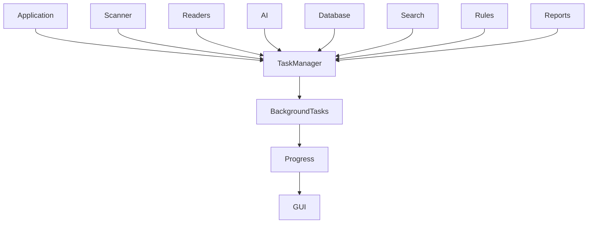
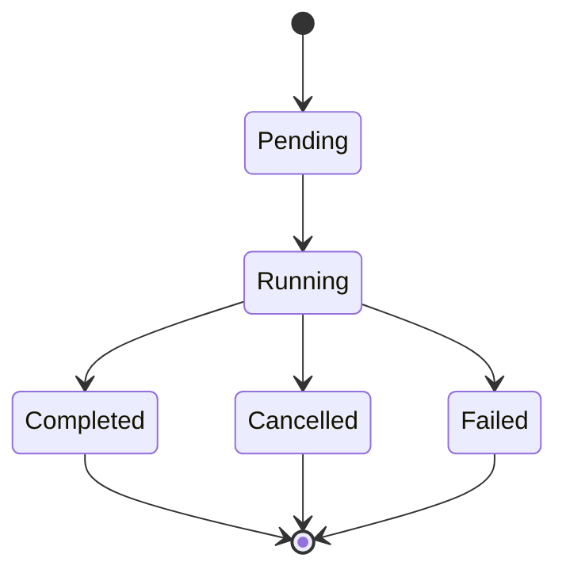

# Task Manager

> This document defines the Task Manager architecture used to coordinate and manage long-running operations within TidyMind.

---

## Purpose

The Task Manager provides a centralized mechanism for executing, monitoring, and controlling background operations.

Its primary purpose is to ensure that long-running tasks do not block the user interface while providing a consistent way to monitor progress, report status, and coordinate task execution throughout the application.

The Task Manager manages task lifecycles rather than performing the work itself.

---

# Responsibilities

The Task Manager is responsible for:

* Managing background tasks.
* Starting and stopping tasks.
* Monitoring task execution.
* Reporting task progress.
* Supporting task cancellation.
* Managing task completion.
* Coordinating concurrent operations.

The Task Manager does not contain business logic for individual tasks.

---

# Scope

### In Scope

* Background task execution
* Task lifecycle management
* Progress reporting
* Task cancellation
* Task monitoring
* Task coordination

### Out of Scope

The Task Manager is **not** responsible for:

* File scanning
* AI processing
* Database operations
* Search indexing
* Rule execution

These responsibilities belong to the subsystems that create the tasks.

---

# Architectural Overview

The Task Manager acts as a coordinator between application components and background operations.

The Task Manager coordinates execution while individual subsystems remain responsible for their own work.

---

# Task Lifecycle

Every task progresses through a defined lifecycle.

Each task should occupy only one lifecycle state at a time.

---

# Task Types

The Task Manager should support various categories of background work.

| Task Type           | Examples                                  |
| ------------------- | ----------------------------------------- |
| File Operations     | Folder scanning, duplicate detection      |
| Document Processing | Content extraction, metadata reading      |
| AI Processing       | Classification, summarization, embeddings |
| Database Operations | Index updates, maintenance                |
| Search Operations   | Index rebuilding                          |
| Reporting           | Statistics generation, exports            |

Additional task types may be introduced as the application evolves.

---

# Progress Reporting

Long-running tasks should expose meaningful progress information whenever practical.

Examples include:

* Current status
* Percentage complete
* Files processed
* Estimated remaining work
* Current operation
* Completion state

Progress information enables the user interface to provide accurate feedback during lengthy operations.

---

# Task Coordination

The Task Manager should coordinate multiple tasks without requiring subsystems to manage one another directly.

Responsibilities include:

* Tracking active tasks.
* Preventing conflicting operations where appropriate.
* Managing task priorities.
* Supporting concurrent execution.
* Providing task status to interested components.

The Task Manager coordinates execution but does not determine business rules.

---

# Design Principles

The Task Manager should follow these principles:

* Non-blocking execution.
* Predictable task lifecycle.
* Clear ownership.
* Safe cancellation.
* Reliable progress reporting.
* Scalable coordination.

Tasks should remain independent and self-contained whenever possible.

---

# Future Considerations

The architecture should support future enhancements, including:

* Task priorities
* Task queues
* Scheduled tasks
* Dependency-aware task execution
* Distributed task execution
* Advanced monitoring and diagnostics

Future capabilities should build upon the existing lifecycle and coordination model.

---

# Related Documents

* [Application](01_Application.md)
* [Application State](06_Application_State.md)
* [Event Bus](04_Event_Bus.md)
* [Logging](03_Logging.md)
* [Scanner Overview](../02_Scanner/00_Overview.md)
