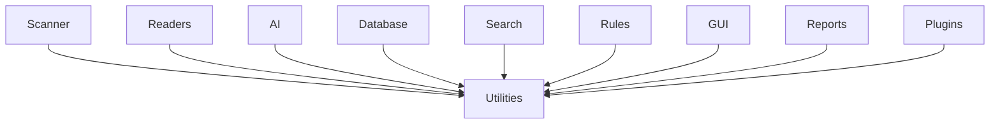

# Utilities

> This document defines the Utilities component, which provides shared helper functionality used throughout TidyMind.

---

## Purpose

The Utilities component provides reusable helper functions and supporting functionality that can be shared across multiple subsystems.

Its purpose is to eliminate code duplication while keeping common functionality centralized, consistent, and easy to maintain.

Utilities should support other components without introducing business logic or unnecessary dependencies.

---

# Responsibilities

The Utilities component is responsible for:

* Providing reusable helper functions.
* Supporting common application operations.
* Reducing duplicated code.
* Improving consistency across subsystems.
* Encapsulating generic functionality.

Utilities exist to support the application—they do not define application behavior.

---

# Scope

### In Scope

* Generic helper functions
* Common data conversions
* String manipulation
* Date and time utilities
* File path utilities
* Collection helpers
* Validation helpers
* Formatting utilities

### Out of Scope

The Utilities component is **not** responsible for:

* Business logic
* Application workflows
* Configuration management
* Database operations
* File scanning
* AI processing
* User interface logic

If functionality belongs to a dedicated subsystem, it should remain within that subsystem rather than becoming a utility.

---

# Architectural Overview

Utilities provide supporting functionality that may be used throughout the application.

Utilities should remain independent and should not depend on higher-level application modules.

---

# Design Principles

Utilities should follow these principles:

* Generic and reusable.
* Independent of business logic.
* Stateless whenever possible.
* Small and focused.
* Well documented.
* Easy to test.

Utilities should solve one problem well rather than becoming collections of unrelated functionality.

---

# Guidelines

When deciding whether functionality belongs in the Utilities component, consider the following questions:

* Is it generic enough to be reused by multiple subsystems?
* Does it avoid application-specific business logic?
* Can it remain independent of higher-level modules?
* Would placing it elsewhere create unnecessary duplication?

If the answer to these questions is **no**, the functionality likely belongs within a dedicated subsystem instead.

---

# Common Utility Categories

Examples of utility categories include:

| Category         | Examples                                     |
| ---------------- | -------------------------------------------- |
| String Utilities | Formatting, normalization, comparison        |
| File Utilities   | Path manipulation, filename handling         |
| Date & Time      | Formatting, calculations, conversions        |
| Validation       | Generic input validation                     |
| Collections      | Common collection operations                 |
| Formatting       | Human-readable sizes, durations, percentages |

These categories are illustrative and may evolve over time.

---

# Design Considerations

The Utilities component should remain intentionally small.

Adding functionality simply because it is "used in multiple places" should be avoided if that functionality naturally belongs to an existing subsystem.

Keeping Utilities focused helps preserve a clean and maintainable architecture.

---

# Related Documents

* [Core Overview](00_Overview.md)
* [Application](01_Application.md)
* [Configuration](02_Configuration.md)
