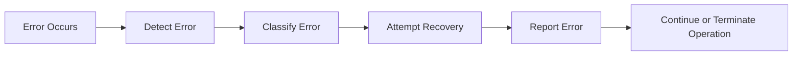

# Error Handling

> This document defines the error handling architecture used throughout TidyMind.

---

## Purpose

The Error Handling component establishes a consistent approach for detecting, reporting, recovering from, and communicating errors across the application.

Its purpose is to ensure that failures are handled predictably, users receive meaningful feedback, and the application remains as stable and reliable as possible.

Error handling is a cross-cutting concern that applies to every subsystem within TidyMind.

---

# Responsibilities

The Error Handling architecture is responsible for:

* Defining a consistent error handling strategy.
* Classifying different categories of errors.
* Reporting failures.
* Coordinating recovery where possible.
* Preventing application instability.
* Providing meaningful feedback to users and developers.

Error handling should minimize the impact of failures while preserving application integrity.

---

# Scope

### In Scope

* Runtime errors
* Startup failures
* Configuration errors
* File system errors
* Database errors
* AI processing failures
* Plugin failures
* Unexpected exceptions
* User-facing error reporting

### Out of Scope

The Error Handling architecture is **not** responsible for:

* Logging implementation
* User notifications
* Business logic
* Validation rules

These responsibilities belong to their respective components.

---

# Error Handling Strategy

Errors should be handled as close as possible to the point where they occur.

If recovery is not possible, the error should be propagated to the appropriate component where it can be handled safely and consistently.

The application should avoid allowing errors to propagate unnecessarily through unrelated parts of the system.

---

# Error Lifecycle

Every error should follow a predictable handling process.

---

# Error Categories

Errors should be classified according to their severity.

| Category    | Description                                                              |
| ----------- | ------------------------------------------------------------------------ |
| Information | Non-critical events that require no action.                              |
| Warning     | Recoverable issues that may affect part of the application.              |
| Error       | Failures that prevent an operation from completing successfully.         |
| Critical    | Severe failures that may prevent the application from continuing safely. |

Consistent classification enables predictable handling across all subsystems.

---

# Recovery Principles

Whenever practical, the application should:

* Continue operating after recoverable failures.
* Isolate failures to the affected subsystem.
* Preserve user data.
* Prevent cascading failures.
* Allow interrupted operations to be retried.

Recovery should always prioritize application stability over completing a failed operation.

---

# User Experience

Errors presented to users should be:

* Clear
* Understandable
* Actionable
* Free from unnecessary technical details

Whenever appropriate, error messages should explain:

* What happened.
* Why the operation failed.
* What the user can do next.

Technical diagnostic information should remain available through the logging system.

---

# Design Principles

The Error Handling architecture follows these principles:

* Fail gracefully.
* Recover whenever possible.
* Isolate failures.
* Preserve application stability.
* Protect user data.
* Maintain consistent behavior.
* Provide meaningful diagnostics.

These principles apply to every subsystem within TidyMind.

---

# Subsystem Responsibilities

Every subsystem is responsible for handling errors within its own domain whenever possible.

Subsystems should:

* Detect failures early.
* Report errors consistently.
* Avoid suppressing unexpected failures.
* Clean up allocated resources.
* Leave the application in a valid state.

Cross-subsystem recovery should be coordinated through the application's shared infrastructure.

---

# Future Considerations

The architecture should support future enhancements, including:

* Centralized error reporting
* Error diagnostics
* Recovery recommendations
* Plugin-specific error isolation
* Automated crash reporting (optional)
* Health monitoring

These capabilities should extend the existing architecture without changing its overall design principles.

---

# Related Documents

* [Logging](03_Logging.md)
* [Application](01_Application.md)
* [Task Manager](07_Task_Manager.md)
* [Application State](06_Application_State.md)
