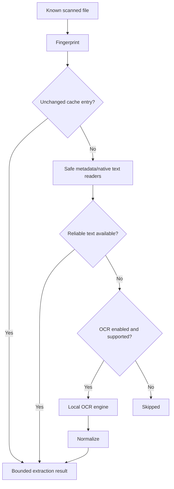

# v1.0 OCR and Metadata Extraction

## Implemented boundary

OpenSorSe 1.0 introduces a bounded local extraction pipeline. Filesystem metadata is always available from the scan. Safe format readers add PDF, Open XML document/workbook, and PNG/JPEG facts without executing macros, formulas, embedded objects, scripts, or remote references. Every value carries provenance and optional confidence.

OCR is a Beta capability. `IOcrService` decides whether OCR is needed, applies settings and bounds, uses a capability-detected `IOcrEngine`, normalizes output, and stores optional local cache records keyed by source fingerprint. The Tesseract CLI adapter supports configured local image OCR when available; OpenSorSe does not install it. PDF OCR requires a future packaged page rasterizer and reports unavailable in the initial release.

## Bounds and privacy

- No reader fetches remote content or executes document behavior.
- DTD processing and XML resolution are disabled.
- Input bytes, text, page counts, duration, and parallelism are bounded.
- Raw text is absent from ordinary logs and diagnostics.
- Cache writes are atomic, versioned, local, and explicitly clearable.
- Source files are never written.

## Capability states

Unavailable, Disabled, Pending, Processing, Completed, SkippedNativeText, SkippedBound, Partial, Failed, Cancelled, and NotIndexed are presented explicitly. Engine name/version is shown only when detected.
