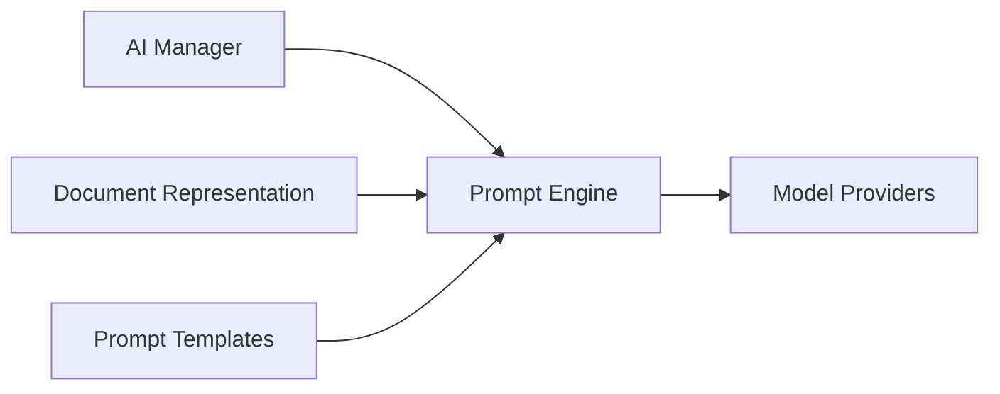

# Prompt Engine

> This document defines the Prompt Engine component, which is responsible for constructing, managing, and preparing prompts for AI interactions within OpenSorSe.

---

## Purpose

The Prompt Engine transforms application requests into structured prompts suitable for AI models.

It provides a centralized mechanism for constructing prompts, injecting document context, applying templates, and preparing requests for execution by the configured AI provider.

The Prompt Engine focuses solely on prompt construction. It does not execute AI requests or interpret AI responses.

## v0.9.1 implementation status

`IAiPromptBuilder` and `AiPromptBuilder` implement two English internal templates: `file-rename-v1` and `folder-structure-v1`. Each prompt serializes clearly named objective, input, allowed scope, mandatory rules, forbidden behavior, response schema, and no-suggestion sections. Context is deterministic and bounded to one rename target plus at most 20 nearby filenames, or at most 25 selected files and 30 existing folder names. Included files are deterministically assigned request-local `item-NNN` identities; the private prompt package retains the mapping to application identities. Folder prompts report total, included, and omitted counts and require each included item exactly once. Preference lists are independently bounded. Absolute paths and file contents are excluded.

Templates are application-owned and provider-neutral rather than embedded in ViewModels or views. English is fixed for this patch release, while stable task identifiers and isolated builders leave room for later localization. User-editable templates are not shipped. Exact prompts and responses can be inspected only in the explicitly enabled, redacted, 20-record session diagnostic buffer.

---

# Responsibilities

The Prompt Engine is responsible for:

* Constructing AI prompts.
* Managing prompt templates.
* Injecting document context.
* Applying prompt variables.
* Preparing provider-ready requests.
* Supporting prompt versioning.
* Maintaining prompt consistency.

---

# Scope

### In Scope

* Prompt construction
* Prompt templates
* Context injection
* Variable substitution
* Prompt formatting
* Prompt validation

### Out of Scope

The Prompt Engine is **not** responsible for:

* AI inference
* Model selection
* Response interpretation
* Document classification
* Summarization
* Response caching

These responsibilities belong to other AI components.

---

# Architectural Overview

The Prompt Engine prepares structured prompts for execution by the configured AI provider.

---

# Prompt Workflow

A typical prompt generation process consists of the following stages:

1. Receive an AI request.
2. Select the appropriate prompt template.
3. Inject document context.
4. Apply variables and configuration.
5. Validate the generated prompt.
6. Produce a provider-ready request.
7. Forward the prompt to the Model Providers component.

---

# Prompt Templates

Prompt templates define reusable instructions for specific AI capabilities.

Examples include:

* Document classification
* Document summarization
* Filename suggestions
* Folder suggestions
* Tag generation
* Keyword extraction

Templates should remain reusable and independent of specific AI providers.

---

# Context Management

The Prompt Engine may incorporate contextual information such as:

* Extracted document text
* Embedded metadata
* Filesystem metadata
* User preferences
* Application configuration
* Previous AI results where appropriate

Only relevant context should be included to improve prompt quality and reduce unnecessary token usage.

---

# Design Principles

The Prompt Engine should remain:

* Provider-independent.
* Template-driven.
* Reusable.
* Configurable.
* Extensible.
* Easy to test.

Prompt construction should be deterministic and independent of AI model implementation details.

---

# Prompt Validation

Before execution, prompts should be validated to ensure:

* Required variables are present.
* Mandatory context has been provided.
* Prompt templates are complete.
* Invalid prompt structures are detected before inference.

Validation helps improve reliability and reduces avoidable AI failures.

---

# Error Handling

The Prompt Engine should handle prompt-related failures gracefully.

Examples include:

* Missing templates.
* Missing variables.
* Invalid prompt configuration.
* Context generation failures.
* Template validation errors.

Prompt generation failures should prevent invalid requests from reaching AI providers.

---

# Future Considerations

The architecture should support future enhancements, including:

* User-customizable prompt templates.
* Versioned prompt libraries.
* Multi-language prompt support.
* Prompt optimization.
* Prompt testing and benchmarking.
* Plugin-defined prompt templates.

These enhancements should preserve the separation between prompt generation and AI execution.

---

# Related Documents

* [AI Overview](00_Overview.md)
* [AI Manager](01_AI_Manager.md)
* [Model Providers](02_Model_Providers.md)
* [Document Classification](04_Document_Classification.md)
* [Summarization](05_Summarization.md)

