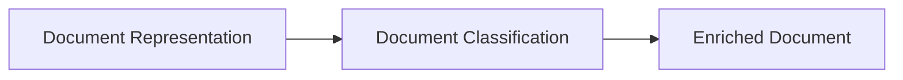

# Document Classification

> This document defines the Document Classification component, which is responsible for identifying and assigning meaningful categories to documents using Artificial Intelligence.

---

## Purpose

The Document Classification component analyzes extracted document information and assigns one or more meaningful classifications.

These classifications enrich the document representation and provide structured information that can be used by downstream components such as Search, Rules, Reports, and the user interface.

The Document Classification component provides information only. It does not make application decisions or perform file operations.

---

# Responsibilities

The Document Classification component is responsible for:

* Classifying documents.
* Assigning categories.
* Identifying document types.
* Generating descriptive labels.
* Producing confidence information where available.
* Enriching document representations.

---

# Scope

### In Scope

* Document categorization
* Multi-label classification
* Confidence scoring
* Category assignment
* Tag generation
* Classification metadata

### Out of Scope

The Document Classification component is **not** responsible for:

* File organization
* Rule execution
* Search indexing
* Summarization
* Document renaming
* Database persistence

These responsibilities belong to downstream architectural components.

---

# Architectural Overview

The Document Classification component enriches document representations with structured classification information.

---

# Classification Workflow

A typical classification process consists of the following stages:

1. Receive a document representation.
2. Determine the applicable classification strategy.
3. Generate a classification request.
4. Execute the AI classification.
5. Validate the returned results.
6. Attach classification information to the document representation.
7. Return the enriched document.

---

# Classification Results

A document may receive information such as:

| Result              | Description                                                 |
| ------------------- | ----------------------------------------------------------- |
| Document Type       | Primary document category.                                  |
| Categories          | One or more assigned categories.                            |
| Tags                | AI-generated descriptive tags.                              |
| Confidence          | Confidence associated with the classification.              |
| Supporting Evidence | Optional explanation of the classification where available. |

The exact output depends on the configured AI provider and classification strategy.

---

# Example Categories

Examples of document classifications include:

* Invoice
* Receipt
* Contract
* Resume
* Letter
* Research Paper
* Medical Record
* Bank Statement
* Presentation
* Spreadsheet
* Photograph
* Manual

These examples are illustrative and are not intended to restrict future classification capabilities.

---

# Design Principles

The Document Classification component should remain:

* Provider-independent.
* Deterministic where practical.
* Explainable where supported.
* Extensible.
* Independent of business rules.
* Independent of file management.

Classification should enrich information rather than trigger actions.

---

# Error Handling

Classification failures should be isolated to the affected document.

Examples include:

* AI inference failures.
* Unsupported document types.
* Low-confidence classifications.
* Invalid AI responses.
* Missing document context.

Failure to classify a document should not prevent subsequent processing by the application.

---

# Future Considerations

The architecture should support future enhancements, including:

* Hierarchical classification.
* User-defined categories.
* Custom classification models.
* Multi-language classification.
* Domain-specific classifiers.
* Plugin-defined classification providers.

These enhancements should preserve the component's primary responsibility of enriching document information.

---

# Related Documents

* [AI Overview](00_Overview.md)
* [AI Manager](01_AI_Manager.md)
* [Prompt Engine](03_Prompt_Engine.md)
* [Summarization](05_Summarization.md)
* [Rules Overview](../07_Rules/00_Overview.md)
* [Keyword Search](../06_Search/01_Keyword_Search.md)
