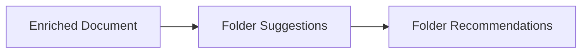

# Folder Suggestions

> This document defines the Folder Suggestions component, which is responsible for generating intelligent folder placement recommendations using Artificial Intelligence.

---

## Purpose

The Folder Suggestions component analyzes document information and recommends appropriate storage locations within a user's organizational structure.

Its primary purpose is to assist users in organizing files by suggesting logical destinations based on document content, metadata, existing folder structures, and user preferences.

The Folder Suggestions component provides recommendations only. It does not move files or modify the filesystem.

---

# Responsibilities

The Folder Suggestions component is responsible for:

* Generating folder recommendations.
* Analyzing document context.
* Considering existing folder structures.
* Respecting user preferences.
* Producing multiple placement alternatives where appropriate.
* Enriching document representations with organization suggestions.

---

# Scope

### In Scope

* Folder recommendations
* Organization suggestions
* Existing folder analysis
* Multiple placement options
* Confidence scoring
* Recommendation metadata

### Out of Scope

The Folder Suggestions component is **not** responsible for:

* Moving files
* Creating folders
* Rule execution
* Filesystem operations
* Search indexing
* Database persistence

These responsibilities belong to downstream architectural components.

---

# Architectural Overview

The Folder Suggestions component enriches document representations with AI-generated folder recommendations.

---

# Recommendation Workflow

A typical recommendation process consists of the following stages:

1. Receive an enriched document.
2. Analyze document content and metadata.
3. Consider the existing folder hierarchy.
4. Apply user preferences and organization rules.
5. Generate one or more folder recommendations.
6. Validate the recommendations.
7. Attach the recommendations to the document representation.
8. Return the enriched document.

---

# Recommendation Characteristics

Generated folder suggestions should strive to be:

* Logical.
* Consistent.
* Explainable where practical.
* Relevant.
* Respectful of the user's existing organizational structure.

Recommendations should complement the user's workflow rather than impose a new one.

---

# Recommendation Types

The component may generate multiple recommendation styles.

| Recommendation              | Description                                                   |
| --------------------------- | ------------------------------------------------------------- |
| Existing Folder             | Suggest an existing destination.                              |
| New Folder                  | Suggest creating a new folder if appropriate.                 |
| Alternative Location        | Offer additional placement options.                           |
| Hierarchical Recommendation | Suggest a parent folder with optional subfolder organization. |

Providing alternatives allows users and automation rules to choose the most appropriate destination.

---

# Context Sources

Folder recommendations may consider information such as:

* Document classification.
* Document summary.
* Extracted metadata.
* Existing folder hierarchy.
* User-defined preferences.
* Previous organization patterns.

The recommendation strategy may evolve as additional information becomes available.

---

# Design Principles

The Folder Suggestions component should remain:

* Advisory.
* Provider-independent.
* Read-only.
* Explainable where practical.
* Extensible.

Recommendations should never modify the user's filesystem directly.

---

# Error Handling

Recommendation failures should be isolated to the affected document.

Examples include:

* AI inference failures.
* Missing organizational context.
* Invalid folder structures.
* Low-confidence recommendations.

Failure to generate folder suggestions should not interrupt subsequent document processing.

---

# Future Considerations

The architecture should support future enhancements, including:

* Learning from user decisions.
* Organization templates.
* Workspace-specific recommendations.
* Shared library recommendations.
* Multi-user organization strategies.
* Plugin-defined recommendation providers.

These enhancements should preserve the component's primary responsibility of generating folder placement recommendations.

---

# Related Documents

* [AI Overview](00_Overview.md)
* [Document Classification](04_Document_Classification.md)
* [Renaming](06_Renaming.md)
* [Rules Overview](../07_Rules/00_Overview.md)
* [User Rules](../07_Rules/05_User_Rules.md)
