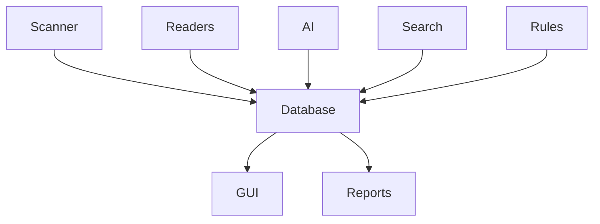
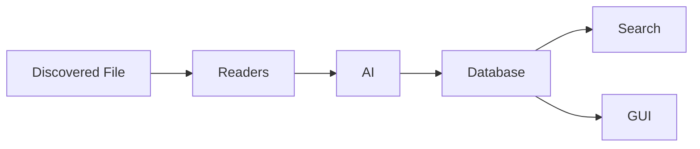

# Database Overview

> This document provides an overview of the Database subsystem, which is responsible for persistently storing and managing all application data within TidyMind.

---

## Purpose

The Database subsystem provides persistent storage for all information managed by TidyMind.

It serves as the application's single source of truth, maintaining document metadata, extracted content, AI enrichments, search indexes, application settings, historical information, and other persistent data required by the system.

The Database subsystem provides reliable, consistent, and durable storage while remaining independent of higher-level application logic.

---

# Responsibilities

The Database subsystem is responsible for:

* Persisting application data.
* Managing document records.
* Storing extracted metadata.
* Storing AI enrichments.
* Managing application settings.
* Recording processing history.
* Supporting search indexes.
* Managing cache storage.
* Supporting backup and recovery.

---

# Scope

### In Scope

* Persistent storage
* Document records
* Metadata storage
* AI enrichment storage
* Application settings
* Processing history
* Cache storage
* Database migrations
* Backup and recovery

### Out of Scope

The Database subsystem is **not** responsible for:

* Reading files
* AI inference
* Search execution
* Rule evaluation
* User interface rendering

These responsibilities belong to other architectural subsystems.

---

# Architectural Overview

The Database subsystem acts as the persistent knowledge layer for TidyMind.

The Database receives information from multiple subsystems and provides a unified source of persistent data for the application.

---

# Stored Information

The Database may store information including:

| Category           | Examples                                |
| ------------------ | --------------------------------------- |
| File Information   | Paths, hashes, filesystem metadata      |
| Document Content   | Extracted text and document structure   |
| AI Enrichments     | Classifications, summaries, suggestions |
| Embeddings         | Semantic vector representations         |
| Search Data        | Search indexes and related metadata     |
| User Settings      | Application configuration               |
| Processing History | Scan history and processing events      |
| Cache              | AI cache metadata and cached results    |

The database schema may evolve as additional application capabilities are introduced.

---

# Database Components

The Database subsystem consists of several specialized components.

| Component  | Responsibility                                  |
| ---------- | ----------------------------------------------- |
| SQLite     | Database engine and storage.                    |
| Schema     | Logical organization of stored data.            |
| Migrations | Schema evolution and upgrades.                  |
| Metadata   | Persistent document metadata.                   |
| History    | Processing history and audit information.       |
| Settings   | User preferences and application configuration. |
| Cache      | Persistent application cache.                   |
| Backups    | Database backup and recovery.                   |

Each component is documented separately within this section.

---

# Data Lifecycle

A typical document progresses through the following lifecycle.

As documents move through the application, the Database becomes the authoritative repository of accumulated knowledge.

---

# Design Principles

The Database subsystem follows several architectural principles:

* Single source of truth.
* Reliable persistence.
* Consistent data integrity.
* Efficient retrieval.
* Extensible schema.
* Platform independence.
* Separation from business logic.

The Database should remain focused on storing and retrieving information rather than implementing application behavior.

---

# Future Considerations

The architecture should support future enhancements, including:

* Alternative database engines.
* Database encryption.
* Multi-user support.
* Synchronization across devices.
* Cloud-backed storage.
* Plugin-defined persistent data.

These enhancements should preserve the role of the Database as the application's persistent knowledge layer.

---

# Related Documents

* [SQLite](01_SQLite.md)
* [Schema](02_Schema.md)
* [Metadata](04_Metadata.md)
* [History](05_History.md)
* [Settings](06_Settings.md)
* [Cache](07_Cache.md)
* [Backups](08_Backups.md)
* [Search Overview](../06_Search/00_Overview.md)
