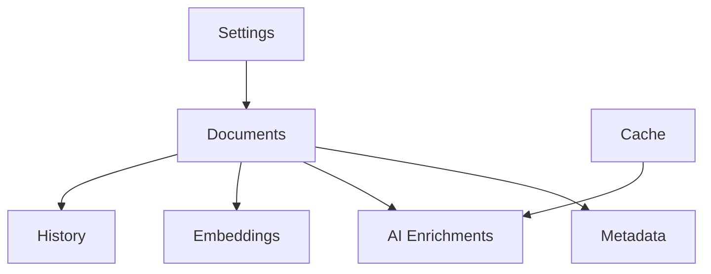

# Schema

> This document defines the logical database schema used by TidyMind for organizing and relating persistent application data.

---

## Purpose

The Database Schema defines how persistent information is logically organized within TidyMind.

It establishes the relationships between application data while ensuring consistency, maintainability, and efficient retrieval.

The schema represents the logical data model of the application rather than a specific SQL implementation.

---

# Responsibilities

The Database Schema is responsible for:

* Defining logical data structures.
* Organizing persistent entities.
* Defining relationships between entities.
* Supporting efficient data retrieval.
* Maintaining data integrity.
* Supporting future schema evolution.

---

# Scope

### In Scope

* Logical entities
* Entity relationships
* Data organization
* Referential integrity
* Persistent document information
* AI enrichment storage

### Out of Scope

The Database Schema is **not** responsible for:

* SQL implementation details
* Query optimization
* Business logic
* Search algorithms
* AI inference
* Filesystem operations

These responsibilities belong to other architectural components.

---

# Architectural Overview

The Database Schema organizes the application's persistent knowledge into related entities.

The exact implementation of these entities may evolve while preserving the overall logical relationships.

---

# Core Entities

The schema consists of several logical entities.

| Entity         | Purpose                                                         |
| -------------- | --------------------------------------------------------------- |
| Documents      | Primary record representing each managed document.              |
| Metadata       | Filesystem and extracted document metadata.                     |
| AI Enrichments | AI-generated classifications, summaries, tags, and suggestions. |
| Embeddings     | Semantic vector representations.                                |
| History        | Processing history and audit information.                       |
| Settings       | Persistent application configuration.                           |
| Cache          | Reusable AI-generated results.                                  |

Additional entities may be introduced as the application evolves.

---

# Relationship Principles

Relationships between entities should follow these principles:

* Clear ownership.
* Minimal duplication.
* Referential integrity.
* Predictable navigation.
* Extensibility.

The schema should avoid unnecessary redundancy while preserving efficient access to information.

---

# Data Organization

Persistent information should be organized according to its purpose.

Examples include:

* Document identity.
* Filesystem information.
* Extracted content.
* AI-generated enrichments.
* Processing history.
* User configuration.
* Cached results.

Each category should remain logically independent while participating in the overall data model.

---

# Data Integrity

The schema should maintain consistency through:

* Unique identifiers.
* Referential relationships.
* Validation constraints.
* Transactional updates.
* Consistent entity ownership.

The database should never contain partially related or inconsistent records after successful operations.

---

# Design Principles

The Database Schema should remain:

* Normalized where practical.
* Extensible.
* Maintainable.
* Consistent.
* Independent of implementation details.

The logical data model should remain stable even as the physical database implementation evolves.

---

# Future Considerations

The architecture should support future enhancements, including:

* Additional document types.
* Plugin-defined entities.
* Schema versioning.
* Multi-workspace support.
* Shared document libraries.
* Cross-device synchronization.

These enhancements should preserve the overall organization of the database.

---

# Related Documents

* [Database Overview](00_Overview.md)
* [SQLite](01_SQLite.md)
* [Migrations](03_Migrations.md)
* [Metadata](04_Metadata.md)
* [History](05_History.md)
* [Settings](06_Settings.md)
* [Cache](07_Cache.md)
