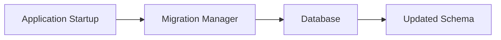

# Migrations

> This document defines the Database Migrations component, which is responsible for safely evolving the database schema across application versions.

---

## Purpose

The Database Migrations component manages changes to the database schema over time.

Its primary purpose is to ensure that existing databases can be upgraded safely and consistently as TidyMind evolves, while preserving user data and maintaining database integrity.

Database migrations provide a controlled mechanism for introducing structural changes without requiring users to recreate their databases.

---

# Responsibilities

The Database Migrations component is responsible for:

* Managing schema versioning.
* Applying database migrations.
* Validating migration integrity.
* Preserving existing data.
* Supporting application upgrades.
* Recording migration history.

---

# Scope

### In Scope

* Schema version management
* Database upgrades
* Migration execution
* Migration validation
* Migration history
* Data preservation

### Out of Scope

The Database Migrations component is **not** responsible for:

* Business logic
* Database backups
* Query optimization
* Search indexing
* AI processing
* Database repair

These responsibilities belong to other architectural components.

---

# Architectural Overview

The Database Migrations component manages schema evolution between application versions.

The application should verify the database schema before normal operation begins.

---

# Migration Workflow

A typical migration process consists of the following stages:

1. Open the existing database.
2. Determine the current schema version.
3. Compare the current version with the application's required version.
4. Identify required migrations.
5. Execute pending migrations.
6. Validate migration success.
7. Record the updated schema version.
8. Continue normal application startup.

---

# Migration Principles

Database migrations should be:

* Sequential.
* Repeatable.
* Deterministic.
* Recoverable.
* Non-destructive where practical.

Every migration should produce a predictable database state.

---

# Version Management

Each database should maintain information including:

| Information         | Description                                                       |
| ------------------- | ----------------------------------------------------------------- |
| Schema Version      | Current database schema version.                                  |
| Migration History   | Applied migration records.                                        |
| Application Version | Application version associated with the schema where appropriate. |
| Migration Timestamp | Time each migration was applied.                                  |

This information supports reliable upgrades and diagnostics.

---

# Data Preservation

Schema evolution should prioritize preserving existing user data.

Examples include:

* Adding new entities.
* Extending existing entities.
* Transforming stored information.
* Migrating legacy formats.
* Removing deprecated structures only when safe.

Data loss should never occur as part of a normal migration process.

---

# Design Principles

The Database Migrations component should remain:

* Reliable.
* Predictable.
* Transparent.
* Recoverable.
* Independent of business logic.

Migration logic should focus solely on schema evolution.

---

# Error Handling

Migration failures should prevent the application from operating on an inconsistent database.

Examples include:

* Failed schema updates.
* Corrupted migration files.
* Incompatible database versions.
* Interrupted migrations.
* Validation failures.

Migration errors should be reported clearly, and the database should remain in a consistent state whenever possible.

---

# Future Considerations

The architecture should support future enhancements, including:

* Migration rollback support.
* Automatic migration verification.
* Dry-run migrations.
* Plugin-defined schema migrations.
* Cross-database migration support.
* Advanced migration diagnostics.

These enhancements should preserve the integrity and reliability of the migration process.

---

# Related Documents

* [Database Overview](00_Overview.md)
* [SQLite](01_SQLite.md)
* [Schema](02_Schema.md)
* [Backups](08_Backups.md)
