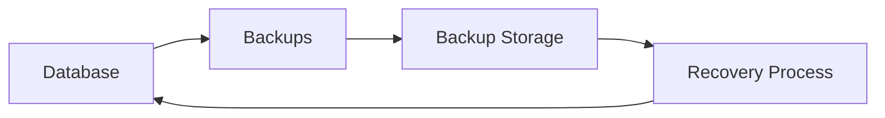

# Backups

> This document defines the Backups component, which is responsible for protecting persistent application data through reliable backup and recovery mechanisms.

---

## Purpose

The Backups component provides mechanisms for creating, storing, and restoring backups of the TidyMind database.

Its primary purpose is to protect user data against accidental loss, corruption, hardware failure, or software errors by maintaining recoverable copies of the application's persistent data.

The Backups component supports recovery but does not provide data synchronization between devices.

---

# Responsibilities

The Backups component is responsible for:

* Creating database backups.
* Managing backup versions.
* Supporting database restoration.
* Verifying backup integrity.
* Protecting persistent application data.
* Supporting backup retention policies.

---

# Scope

### In Scope

* Database backups
* Backup restoration
* Backup validation
* Backup integrity verification
* Backup retention
* Recovery support

### Out of Scope

The Backups component is **not** responsible for:

* Cloud synchronization
* File synchronization
* Database migrations
* Application updates
* Business logic
* User settings management

These responsibilities belong to other architectural components.

---

# Architectural Overview

The Backups component protects the persistent database by maintaining recoverable backup copies.

The backup process should operate independently of normal application usage whenever practical.

---

# Backup Workflow

A typical backup process consists of the following stages:

1. Verify database consistency.
2. Create a backup snapshot.
3. Validate the backup.
4. Store the backup.
5. Record backup metadata.
6. Apply retention policies where appropriate.

A restoration process performs the reverse sequence while validating the selected backup before recovery.

---

# Backup Types

The architecture should support multiple backup strategies.

| Backup Type          | Description                                             |
| -------------------- | ------------------------------------------------------- |
| Manual Backup        | Created on user request.                                |
| Automatic Backup     | Created according to application configuration.         |
| Pre-Migration Backup | Created before database schema upgrades.                |
| Pre-Restore Backup   | Optional safety backup before restoring another backup. |

Additional backup strategies may be introduced in the future.

---

# Backup Integrity

Each backup should be validated before it is considered usable.

Validation may include:

* Database consistency.
* Backup completeness.
* File integrity.
* Schema compatibility.
* Version information.

A failed validation should prevent the backup from being presented as a valid recovery point.

---

# Recovery Principles

Recovery operations should strive to be:

* Reliable.
* Predictable.
* Safe.
* Verifiable.
* Non-destructive where practical.

Users should be able to restore application data with confidence while minimizing the risk of further data loss.

---

# Design Principles

The Backups component should remain:

* Independent.
* Reliable.
* Transparent.
* Easy to configure.
* Focused on recovery.

Backup functionality should remain separate from synchronization and data sharing mechanisms.

---

# Error Handling

Backup-related failures should be reported clearly to the user.

Examples include:

* Backup creation failures.
* Insufficient storage.
* Corrupted backup files.
* Validation failures.
* Restore failures.

Whenever practical, the application should preserve the existing database until a successful restoration has been verified.

---

# Future Considerations

The architecture should support future enhancements, including:

* Incremental backups.
* Encrypted backups.
* Compression.
* Cloud backup providers.
* Scheduled backup policies.
* Plugin-defined backup providers.

These enhancements should preserve the component's primary responsibility of protecting persistent application data.

---

# Related Documents

* [Database Overview](00_Overview.md)
* [SQLite](01_SQLite.md)
* [Migrations](03_Migrations.md)
* [Settings](06_Settings.md)
* [History](05_History.md)
