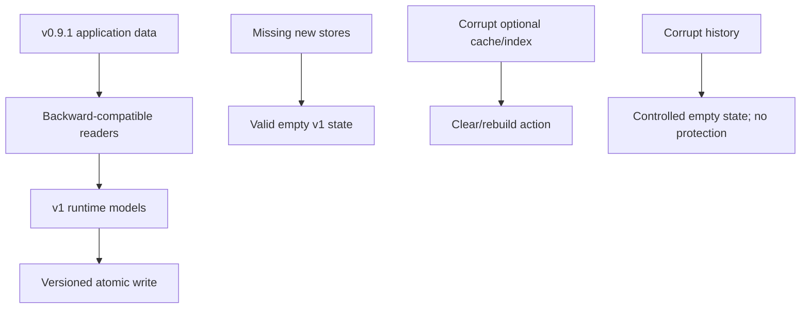

# v1.0 Local Content Stores and Migrations

OpenSorSe continues to use bounded atomic JSON rather than introducing a database dependency for 1.0.

| Store | Contains | Does not contain |
| --- | --- | --- |
| `content-index.json` | Source fingerprint, bounded metadata, bounded native/OCR text, engine facts, provenance tags | File bytes, embeddings, credentials |
| `semantic-index.json` | Searchable fields, tag facts, bounded vector, source fingerprint | Raw files, model files |
| `structure-history.json` | Bounded relative structure snapshots and operation outcomes | File contents, undo payloads |

Each envelope has an explicit schema version. Temporary siblings are used for atomic replacement. Unsupported or corrupt optional cache/index/history files produce a controlled empty or rebuild state and cannot activate repeat protection.

Existing settings, catalog schema 1/2, tags, saved searches, and AI decisions remain readable. New settings are optional and default off. Migration never touches selected user files.

