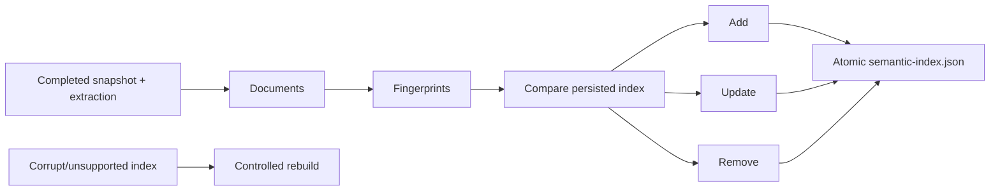

# v1.0 Semantic Search Beta

## Purpose

Semantic Search Beta provides local, explainable hybrid retrieval across filenames, paths, confirmed/suggested tags, deterministic categories, metadata, native text, and OCR text. It does not require AI or a network service.

## Components

| Component | Responsibility |
| --- | --- |
| `IEmbeddingProvider` | Produces deterministic normalized vectors |
| `ISemanticIndexer` | Incrementally builds/removes versioned records |
| `ISemanticIndexStore` | Loads, atomically saves, clears, and recovers the index |
| `ISemanticSearchService` | Combines lexical, provenance, metadata, and vector signals |

The bundled provider uses bounded token feature hashing into 256 dimensions. It is deterministic and portable, not a claim of model-grade semantic quality.

## Ranking

Exact filename and confirmed user-tag matches dominate. Embedded metadata, path, dates, categories, text terms, and vector similarity follow. Suggested tags and low-confidence OCR remain down-weighted. Each hit lists its contributing signals and score.

## Lifecycle

Indexing and search are cancellable, bounded, local, and never alter source files.
