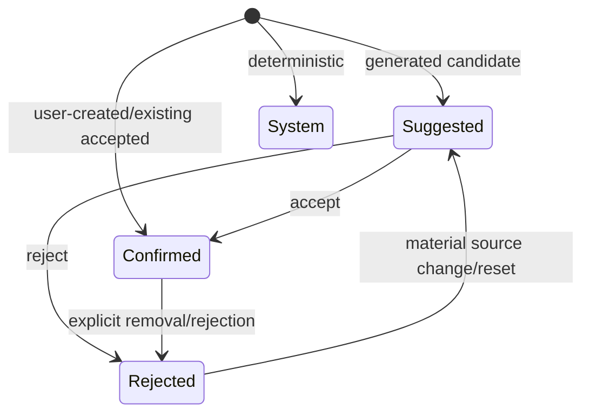

# v1.0 Tag Provenance

Tags are the shared classification layer for Results filtering, catalog search, Semantic Search Beta, folder suggestions, rules, and structure summaries.

## Model

Every tag records file identity, normalized/display values, source, state, confidence, creation/update time, source fingerprint, and bounded provenance. Sources include User, ExistingAccepted, Rule, EmbeddedMetadata, OCR, Semantic, FileType, Date, FolderContext, and AI.

States are Confirmed, Suggested, Rejected, and System. A low-confidence generated value never becomes Confirmed automatically. User-confirmed tags receive the highest search weight. Rejected generated tags are suppressed while their source fingerprint remains unchanged.

Existing `TagAssociation` records migrate in memory: user-approved values become confirmed User tags; deterministic extension values become System/FileType tags. Catalog compatibility is preserved.

