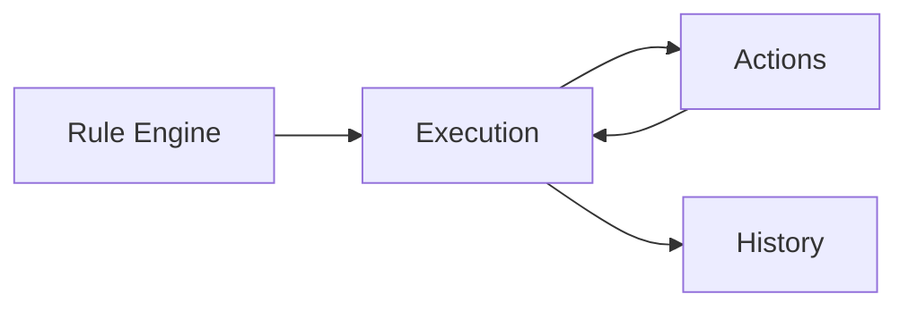

# Execution

> This document defines the Execution component, which is responsible for managing the lifecycle of rule execution within TidyMind.

---

## Purpose

The Execution component manages how automation rules are executed after they have been evaluated by the Rule Engine.

Its primary purpose is to ensure that rule actions execute in a predictable, reliable, and controlled manner while handling sequencing, failures, and execution outcomes.

The Execution component governs the execution process rather than defining rules or actions.

---

# Responsibilities

The Execution component is responsible for:

* Managing rule execution lifecycles.
* Coordinating action sequencing.
* Tracking execution progress.
* Recording execution outcomes.
* Handling execution failures.
* Returning execution status.

---

# Scope

### In Scope

* Execution management
* Action sequencing
* Execution status
* Failure handling
* Execution reporting
* Execution lifecycle management

### Out of Scope

The Execution component is **not** responsible for:

* Rule evaluation
* Condition evaluation
* Action implementation
* AI inference
* Database persistence
* User interface rendering

These responsibilities belong to other architectural components.

---

# Architectural Overview

The Execution component manages the runtime behavior of automation after the Rule Engine determines that a rule should execute.

The Execution component coordinates action execution and records the overall execution outcome.

---

# Execution Workflow

A typical rule execution consists of the following stages:

1. Receive an execution request.
2. Initialize execution context.
3. Execute configured actions.
4. Monitor execution progress.
5. Handle failures where necessary.
6. Record execution results.
7. Return the final execution status.

Execution should remain predictable and repeatable.

---

# Execution States

A rule execution may transition through states including:

| State     | Description                                |
| --------- | ------------------------------------------ |
| Pending   | Waiting to begin execution.                |
| Running   | Actions are currently executing.           |
| Completed | All actions completed successfully.        |
| Failed    | One or more actions failed.                |
| Cancelled | Execution was cancelled before completion. |

Additional execution states may be introduced as the application evolves.

---

# Execution Principles

Rule execution should be:

* Predictable.
* Observable.
* Isolated.
* Reliable.
* Recoverable where practical.

Each rule execution should produce a clear and traceable outcome.

---

# Design Principles

The Execution component should remain:

* Independent of rule definitions.
* Independent of condition logic.
* Independent of action implementation.
* Extensible.
* Easy to monitor.

Its responsibility is limited to managing the execution lifecycle.

---

# Error Handling

Execution failures should be managed consistently.

Examples include:

* Action failures.
* Interrupted execution.
* Timeout conditions.
* Cancellation requests.
* Unexpected runtime exceptions.

Whenever practical, execution failures should be isolated to the affected rule without impacting unrelated automation.

---

# Future Considerations

The architecture should support future enhancements, including:

* Parallel action execution.
* Transactional execution.
* Rollback support.
* Retry policies.
* Execution priorities.
* Plugin-defined execution strategies.

These enhancements should preserve the component's primary responsibility of managing rule execution.

---

# Related Documents

* [Rules Overview](00_Overview.md)
* [Rule Engine](01_Rule_Engine.md)
* [Conditions](02_Conditions.md)
* [Actions](03_Actions.md)
* [User Rules](05_User_Rules.md)
* [History](../05_Database/05_History.md)
