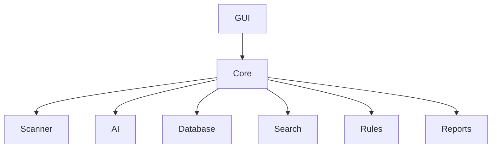

# GUI Overview

> This document provides an overview of the Graphical User Interface (GUI) subsystem, which is responsible for presenting information and enabling user interaction within OpenSorSe.

---

## Purpose

The GUI subsystem provides the primary interface through which users interact with OpenSorSe.

Its purpose is to present application data, visualize processing results, provide access to application functionality, and enable users to configure and control the system.

The GUI serves as the presentation layer of the application and remains independent of the application's business logic.

---

# Responsibilities

The GUI subsystem is responsible for:

* Presenting application data.
* Displaying processing progress.
* Managing user interaction.
* Providing application navigation.
* Displaying search results.
* Presenting reports.
* Managing application dialogs.
* Displaying notifications.

---

# Scope

### In Scope

* Windows and pages
* Navigation
* User interaction
* Data presentation
* Application dialogs
* Notifications
* Themes

### Out of Scope

The GUI subsystem is **not** responsible for:

* AI inference
* Search execution
* Rule evaluation
* Database management
* File scanning
* Business logic

These responsibilities belong to other architectural subsystems.

---

# Architectural Overview

The GUI provides a presentation layer over the application's core functionality.

The GUI communicates with the application through well-defined interfaces while remaining independent of subsystem implementation details.

---

# GUI Components

The GUI subsystem consists of several specialized components.

| Component     | Responsibility                       |
| ------------- | ------------------------------------ |
| Main Window   | Primary application window.          |
| Dashboard     | System overview and quick actions.   |
| Scanner Page  | File scanning and progress.          |
| Results Page  | Display processing results.          |
| History Page  | Document history and activity.       |
| Settings Page | Application configuration.           |
| Reports Page  | Statistics and analytics.            |
| Dialogs       | User interaction dialogs.            |
| Notifications | User feedback and alerts.            |
| Themes        | Appearance and visual customization. |

Each component is documented separately within this section.

---

# User Interaction Flow

A typical interaction consists of the following stages:

1. User performs an action.
2. GUI forwards the request.
3. Appropriate subsystem performs the work.
4. Results are returned.
5. GUI updates the displayed information.

The GUI should remain responsive while long-running operations execute in the background.

---

# User Experience Principles

The GUI should strive to be:

* Responsive.
* Predictable.
* Accessible.
* Consistent.
* Informative.
* Non-intrusive.

The interface should help users understand the application's state without overwhelming them.

---

# Design Principles

The GUI subsystem should remain:

* Independent of business logic.
* Modular.
* Extensible.
* Platform-aware.
* Easy to maintain.

Presentation logic should remain separate from application functionality.

---

# Future Considerations

The architecture should support future enhancements, including:

* Multiple window layouts.
* Workspace customization.
* Accessibility improvements.
* Plugin-defined interface components.
* Multi-language user interfaces.
* Additional visual themes.

These enhancements should preserve the GUI subsystem's primary responsibility of presenting information and supporting user interaction.

---

# Related Documents

* [Main Window](01_Main_Window.md)
* [Dashboard](02_Dashboard.md)
* [Scanner Page](03_Scanner_Page.md)
* [Results Page](04_Results_Page.md)
* [History Page](05_History_Page.md)
* [Settings Page](06_Settings_Page.md)
* [Reports Page](07_Reports_Page.md)
* [Dialogs](08_Dialogs.md)
* [Notifications](09_Notifications.md)
* [Themes](10_Themes.md)
