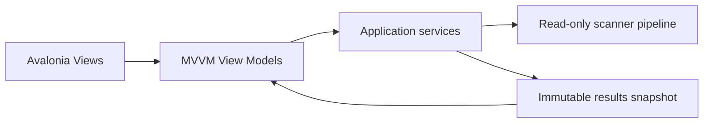

# GUI Overview

> The current GUI is an Avalonia MVVM desktop application focused on a safe, read-only scan and review workflow.

---

## Current scope

The implemented Desktop application hosts these user-facing areas:

| Component | Current role |
| --- | --- |
| Main Window | Hosts application navigation and shared status. |
| Dashboard | Shows current-session summary and routes to primary workflows. |
| Scan | Accepts selected local folders and presents processing progress and cancellation. |
| Results | Hosts the Results Explorer, selected details, warnings, and exact-duplicate review. |
| Rules | Presents in-memory deterministic rule editing and validation. |
| Settings | Edits implemented application settings. |
| Diagnostics | Presents aggregate logging health. |
| Operation History | Presents in-memory, review-only history state. |
| Notifications | Shows non-blocking user-safe status messages. |

The current GUI does not expose execution, undo, file opening, file revealing, result export, AI, OCR, or semantic search controls.

## Presentation boundary

Views and view models present already-computed application data. They must not perform filesystem access, execute planned operations, or bypass the Application layer.

## Current usability guarantees

- Scan progress and cancellation are visible.
- Results are bounded through paging and are filtered and sorted in memory.
- Result and duplicate details reflect the completed scan; they do not inspect the live filesystem.
- The Results surface includes persistent read-only safety wording.
- Empty, limitation, and error states use user-safe messages.

## Future design material

The remaining GUI documents may describe future pages or extension points such as reports, dialogs, themes, and plugin-provided UI. Those descriptions are design intent unless a current release document or implementation specification identifies a feature as implemented.

## Related documents

- [System Overview](../00_System/00_Overview.md)
- [Results Page](04_Results_Page.md)
- [Release Status](../../RELEASE_STATUS.md)
