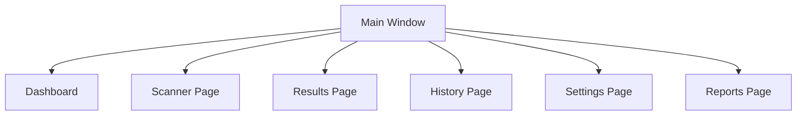

# Main Window

> This document defines the Main Window component, which serves as the primary application shell for TidyMind.

---

## Purpose

The Main Window provides the primary application shell through which users access all major functionality within TidyMind.

Its purpose is to host navigation, present application pages, manage the overall window layout, and provide a consistent user experience across the application.

The Main Window does not implement business logic or application workflows.

---

# Responsibilities

The Main Window is responsible for:

* Hosting application pages.
* Managing application navigation.
* Providing a consistent layout.
* Displaying global application controls.
* Managing application-level window behavior.
* Coordinating visual presentation.

---

# Scope

### In Scope

* Main application window
* Navigation
* Layout management
* Toolbar
* Status bar
* Window state
* Global menus

### Out of Scope

The Main Window is **not** responsible for:

* File scanning
* Search execution
* AI processing
* Rule evaluation
* Database operations
* Business logic

These responsibilities belong to other architectural components.

---

# Architectural Overview

The Main Window provides a common shell that hosts the application's primary pages.

The Main Window is responsible for page hosting and navigation rather than page implementation.

---

# Window Layout

The Main Window may consist of the following regions:

| Region            | Purpose                                   |
| ----------------- | ----------------------------------------- |
| Title Bar         | Application title and window controls.    |
| Navigation Panel  | Access to major application pages.        |
| Main Content Area | Displays the currently selected page.     |
| Toolbar           | Frequently used application actions.      |
| Status Bar        | Displays application status and progress. |

The exact visual layout may evolve without changing the underlying architecture.

---

# Navigation Principles

The Main Window should provide:

* Consistent navigation.
* Clear page hierarchy.
* Persistent navigation state.
* Efficient access to common tasks.
* Predictable page transitions.

Navigation should remain independent of page implementation.

---

# User Experience Principles

The Main Window should strive to be:

* Clean.
* Responsive.
* Consistent.
* Easy to navigate.
* Accessible.

The application shell should provide a stable and familiar user experience.

---

# Design Principles

The Main Window should remain:

* Lightweight.
* Independent of business logic.
* Modular.
* Extensible.
* Focused on presentation.

Its responsibility is limited to hosting and organizing the application's interface.

---

# Error Handling

The Main Window should handle presentation-related issues gracefully.

Examples include:

* Page loading failures.
* Invalid navigation requests.
* Window restoration issues.
* Missing interface components.

Whenever practical, individual page failures should not affect the overall application shell.

---

# Future Considerations

The architecture should support future enhancements, including:

* Dockable panels.
* Multiple window support.
* Customizable layouts.
* Workspace management.
* Plugin-defined pages.
* Multi-monitor support.

These enhancements should preserve the Main Window's primary responsibility of hosting the application's interface.

---

# Related Documents

* [GUI Overview](00_Overview.md)
* [Dashboard](02_Dashboard.md)
* [Scanner Page](03_Scanner_Page.md)
* [Results Page](04_Results_Page.md)
* [History Page](05_History_Page.md)
* [Settings Page](06_Settings_Page.md)
* [Reports Page](07_Reports_Page.md)
