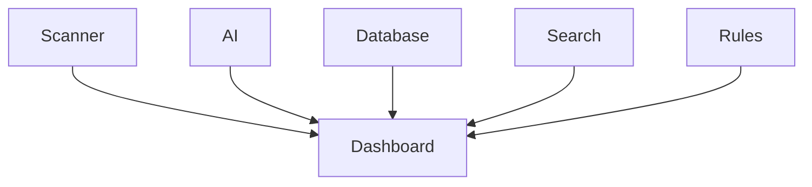

# Dashboard

> This document defines the Dashboard component, which provides an overview of the application's current state and quick access to frequently used functionality.

---

## Purpose

The Dashboard serves as the primary landing page for TidyMind.

Its purpose is to provide users with a high-level overview of their document library, recent activity, processing status, storage insights, and quick access to common tasks.

The Dashboard presents information gathered from other subsystems without implementing business logic.

---

# Responsibilities

The Dashboard is responsible for:

* Displaying system status.
* Presenting processing summaries.
* Showing recent activity.
* Displaying storage statistics.
* Providing quick actions.
* Highlighting important notifications.

---

# Scope

### In Scope

* System overview
* Recent activity
* Quick actions
* Storage summaries
* Scan status
* Processing statistics
* Application health indicators

### Out of Scope

The Dashboard is **not** responsible for:

* File scanning
* Search execution
* AI processing
* Rule execution
* Database management
* Business logic

These responsibilities belong to other architectural components.

---

# Architectural Overview

The Dashboard aggregates information from multiple subsystems into a unified overview.

The Dashboard consumes application data and presents it through a consolidated user interface.

---

# Dashboard Sections

The Dashboard may present information including:

| Section            | Purpose                                                         |
| ------------------ | --------------------------------------------------------------- |
| System Overview    | Overall application status and health.                          |
| Recent Activity    | Recently scanned, updated, or processed documents.              |
| Processing Status  | Active scans, indexing, AI processing, and automation.          |
| Storage Statistics | Number of documents, storage usage, duplicates, and categories. |
| Quick Actions      | Frequently used operations such as scanning or searching.       |
| Notifications      | Important alerts and recommendations.                           |

The displayed information may evolve as additional application capabilities are introduced.

---

# User Workflow

A typical Dashboard interaction consists of the following stages:

1. Open the application.
2. Display current application status.
3. Review recent activity and notifications.
4. Launch common tasks through quick actions.
5. Navigate to detailed application pages when required.

The Dashboard should provide immediate awareness of the application's current state.

---

# User Experience Principles

The Dashboard should strive to be:

* Informative.
* Minimal.
* Responsive.
* Action-oriented.
* Easy to understand.

Users should be able to understand the overall state of the application within a few seconds.

---

# Design Principles

The Dashboard should remain:

* Read-only where practical.
* Independent of business logic.
* Modular.
* Extensible.
* Focused on summarizing information.

Its responsibility is limited to presenting a consolidated overview of application data.

---

# Error Handling

Dashboard presentation failures should not affect the rest of the application.

Examples include:

* Missing statistics.
* Delayed subsystem responses.
* Incomplete activity information.
* Unavailable summary data.

Whenever practical, unavailable information should be replaced with appropriate placeholders or status indicators.

---

# Future Considerations

The architecture should support future enhancements, including:

* User-customizable widgets.
* Personalized dashboards.
* Plugin-defined dashboard panels.
* Workspace-specific dashboards.
* AI-generated insights.
* Interactive analytics.

These enhancements should preserve the Dashboard's primary responsibility of providing an application overview.

---

# Related Documents

* [GUI Overview](00_Overview.md)
* [Main Window](01_Main_Window.md)
* [Scanner Page](03_Scanner_Page.md)
* [Reports Page](07_Reports_Page.md)
* [Notifications](09_Notifications.md)
