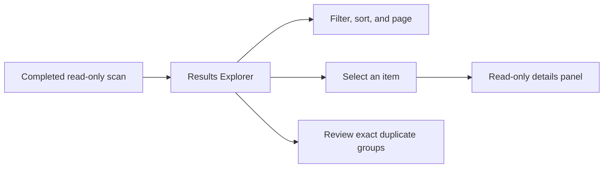

# Results Explorer

> This document defines the read-only Results Explorer delivered in v0.2 and extended in v0.3.

---

## Purpose

Results Explorer presents one completed scan snapshot so users can understand the files that were analyzed and review exact duplicate candidates. It supports investigation only: it never renames, moves, deletes, or otherwise modifies user files.

---

## Responsibilities

The Results Explorer is responsible for:

* Displaying scanned-file metadata and derived duplicate status without exposing raw hashes.
* Filtering the in-memory results snapshot.
* Sorting results by supported fields and direction.
* Paging large result sets.
* Showing a focused details panel for the selected item.
* Presenting exact duplicate groups derived from matching hashes.
* Showing scan and rule diagnostics relevant to the snapshot.
* Performing metadata-aware ranked search with concise match explanations.
* Showing accepted in-memory tags and optional validated AI suggestion previews.

---

## Boundaries

The page and its view models do not perform filesystem traversal, read file contents, calculate hashes, execute rules, or modify files. They obtain completed state through application-layer services and keep presentation state separate from the scan pipeline.

Filtering, sorting, paging, selection, ranked search, and accepted tags operate on the current snapshot. They are not a document-content search engine, a persistent catalog, or semantic search. Optional AI suggestions are never execution controls: accepting, rejecting, or editing records a decision only.

---

## User Flow

---

## Safety and MVVM Requirements

* View models expose state and commands; views contain presentation concerns only.
* Long-running scan work remains outside the page and reports progress through the application layer.
* UI updates are marshalled safely to the UI thread.
* Cancellation belongs to the scan operation; changing filters or pages must not mutate the completed scan data.
* No command in this page performs a file-system write.

---

## Deferred Capabilities

Content previews, AI summaries, suggested actions, approval workflows, document-content search, exports, and file-changing workflows are not part of v0.2. They require explicit future scope and must preserve the product's safety guarantees.

---

## Related Documents

* [GUI Overview](00_Overview.md)
* [Data Flow](../00_System/04_Data_Flow.md)
* [Release Status](../../RELEASE_STATUS.md)
