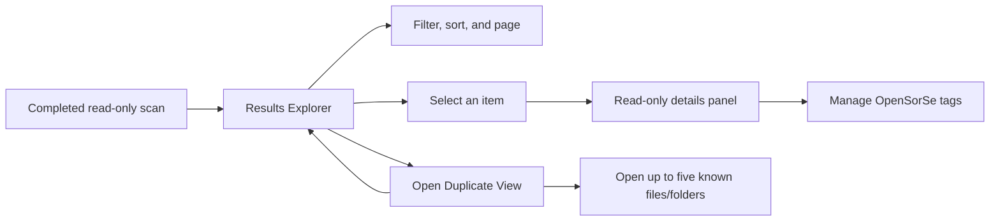

# Results Explorer and Duplicate View

> This document defines the read-only Results Explorer delivered in v0.2 and refined through OpenSorSe 1.0.

---

## Purpose

Results Explorer presents one completed scan snapshot so users can understand the files that were analyzed and review exact duplicate candidates. It supports investigation only: it never renames, moves, deletes, or otherwise modifies user files.

---

## Responsibilities

The Results Explorer is responsible for:

* Displaying scanned-file metadata and derived duplicate status without exposing raw hashes.
* Filtering the in-memory results snapshot.
* Sorting results by supported fields and direction.
* Paging large result sets.
* Showing a focused details panel for the selected item.
* Presenting exact duplicate groups derived from matching hashes.
* Showing scan and rule diagnostics relevant to the snapshot.
* Performing metadata-aware ranked search with concise match explanations.
* Showing accepted in-memory tags and optional validated AI suggestion previews.
* Adding/removing up to twelve accepted non-deterministic OpenSorSe metadata tags for the selected result.
* Presenting responsive Duplicate View groups with plain-language summaries, selected-member controls, and theoretical possible savings.
* Explicitly opening a bounded set of known current-scan files or containing folders through the operating system for comparison.

---

## Boundaries

The page and its view models do not perform filesystem traversal, read file contents, calculate hashes, execute rules, or modify files. They obtain completed state through application-layer services and keep presentation state separate from the scan pipeline.

Filtering, sorting, paging, selection, ranked search, and accepted tags operate on the current snapshot. The toolbar remains fixed while the bounded row region scrolls independently. User-tag controls update only application associations and raise the existing catalog-persistence signal for catalog-backed snapshots. They are not embedded metadata editing. The separate Semantic Search Beta page owns bounded content-aware search. Optional AI suggestions are never execution controls: accepting, rejecting, or editing records a decision only.

Duplicate View can ask `IExternalFileLauncher` to open only direct paths represented by known rows in the current snapshot. A command opens at most five targets, uses an argument-safe platform launch rather than a constructed command line, supports cancellation, continues after individual failures, and reports partial success. Two-member groups alone expose **Open both files**. Historical catalog entries and unknown or stale rows are not launchable.

---

## User Flow

---

## Safety and MVVM Requirements

* View models expose state and commands; views contain presentation concerns only.
* Long-running scan work remains outside the page and reports progress through the application layer.
* UI updates are marshalled safely to the UI thread.
* Cancellation belongs to the scan operation; changing filters or pages must not mutate the completed scan data.
* No command in this page performs a selected-file-system write. Optional persistence is confined to the application-owned catalog path.
* External opening is explicit and bounded; it is not an OpenSorSe file operation or cleanup recommendation.

---

## Deferred Capabilities

Content previews, AI summaries, automatic duplicate cleanup, and exports are not part of 1.0. Results Explorer contains no file-changing command. The separately enabled Semantic Search Beta page provides bounded content-aware retrieval, and the separately confirmed deterministic restructuring workflow owns the only 1.0 source-location changes.

---

## Related Documents

* [GUI Overview](00_Overview.md)
* [Data Flow](../00_System/04_Data_Flow.md)
* [Release Status](../../RELEASE_STATUS.md)
