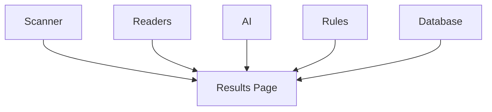

# Results Page

> This document defines the Results Page component, which presents the outcomes of document processing and enables users to review, validate, and act upon those results.

---

## Purpose

The Results Page provides a centralized workspace for reviewing the information generated during document processing.

Its purpose is to present discovered documents, extracted metadata, AI enrichments, duplicate detection results, and automation outcomes in a structured and interactive manner.

The Results Page enables users to review and approve suggested actions while remaining independent of the underlying processing logic.

---

# Responsibilities

The Results Page is responsible for:

* Displaying processed documents.
* Presenting extracted metadata.
* Displaying AI-generated insights.
* Showing duplicate detection results.
* Presenting automation outcomes.
* Providing document review capabilities.
* Allowing user approval of suggested actions.

---

# Scope

### In Scope

* Processing results
* Document previews
* Metadata display
* AI summaries
* AI suggestions
* Duplicate review
* User confirmation actions

### Out of Scope

The Results Page is **not** responsible for:

* File scanning
* AI inference
* Rule execution
* Search execution
* Database management
* Business logic

These responsibilities belong to other architectural components.

---

# Architectural Overview

The Results Page aggregates information from multiple subsystems and presents it as a unified processing workspace.

The Results Page presents processing outcomes without performing processing itself.

---

# User Workflow

A typical review workflow consists of the following stages:

1. Open processing results.
2. Review discovered documents.
3. Inspect extracted metadata.
4. Review AI-generated classifications, summaries, and suggestions.
5. Examine duplicate detection results.
6. Approve, reject, or modify suggested actions.
7. Continue with further organization if required.

The page should support efficient review of both individual documents and large batches.

---

# Displayed Information

The Results Page may present information including:

| Information        | Description                                |
| ------------------ | ------------------------------------------ |
| Document List      | Processed documents.                       |
| Metadata           | File properties and extracted information. |
| AI Classification  | AI-assigned document category.             |
| Summary            | AI-generated document summary.             |
| Rename Suggestions | Suggested filenames.                       |
| Folder Suggestions | Recommended storage locations.             |
| Duplicate Status   | Duplicate detection results.               |
| Rule Outcomes      | Automation actions performed or suggested. |

Additional result types may be introduced as the application evolves.

---

# User Experience Principles

The Results Page should strive to be:

* Informative.
* Efficient.
* Transparent.
* Easy to navigate.
* Focused on review and decision-making.

Users should always understand why a suggestion was made whenever practical.

---

# Design Principles

The Results Page should remain:

* Read-oriented.
* Independent of business logic.
* Modular.
* Extensible.
* Focused on presenting processing outcomes.

Its responsibility is limited to displaying information and collecting user decisions.

---

# Error Handling

The Results Page should present processing issues clearly.

Examples include:

* AI processing failures.
* Metadata extraction warnings.
* Duplicate detection issues.
* Rule execution failures.
* Missing previews.

Whenever practical, unavailable information should not prevent users from reviewing other processing results.

---

# Future Considerations

The architecture should support future enhancements, including:

* Bulk review workflows.
* Side-by-side document comparison.
* AI explanation panels.
* User annotations.
* Custom result layouts.
* Plugin-defined result views.

These enhancements should preserve the Results Page's primary responsibility of presenting document processing outcomes.

---

# Related Documents

* [GUI Overview](00_Overview.md)
* [Scanner Page](03_Scanner_Page.md)
* [History Page](05_History_Page.md)
* [Rules Overview](../07_Rules/00_Overview.md)
* [AI Overview](../04_AI/00_Overview.md)
