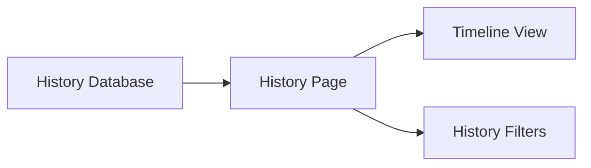

# History Page

> This document defines the History Page component, which presents the historical activity and lifecycle of documents processed by OpenSorSe.

---

## Purpose

The History Page provides users with a chronological view of document-related activity throughout the application.

Its purpose is to present processing history, automation events, user actions, and significant document lifecycle events in an understandable and searchable format.

The History Page presents historical information but does not generate or modify history records.

---

# Responsibilities

The History Page is responsible for:

* Displaying document history.
* Presenting processing timelines.
* Displaying automation history.
* Presenting user actions.
* Supporting history browsing.
* Providing history filtering.

---

# Scope

### In Scope

* Processing history
* Timeline visualization
* Rule history
* AI history
* User activity
* History filtering

### Out of Scope

The History Page is **not** responsible for:

* Recording history
* Rule execution
* AI inference
* File scanning
* Database management
* Business logic

These responsibilities belong to other architectural components.

---

# Architectural Overview

The History Page retrieves historical information from the Database and presents it as an interactive timeline.

The History Page visualizes historical events while remaining independent of how those events were recorded.

---

# User Workflow

A typical history review consists of the following stages:

1. Open the History Page.
2. Browse recent activity.
3. Filter historical events.
4. Inspect individual document timelines.
5. Review automation outcomes.
6. Navigate to related documents where appropriate.

The page should make it easy to understand how documents have changed over time.

---

# Displayed Information

The History Page may present information including:

| Information         | Description                                    |
| ------------------- | ---------------------------------------------- |
| Processing Events   | Scan, extraction, indexing, and AI processing. |
| Rule Executions     | Automation actions performed.                  |
| User Actions        | Manual operations performed by the user.       |
| File Operations     | Moves, renames, and updates.                   |
| Errors and Warnings | Significant processing issues.                 |
| Timestamps          | When each event occurred.                      |

Additional history information may be introduced as the application evolves.

---

# User Experience Principles

The History Page should strive to be:

* Chronological.
* Informative.
* Searchable.
* Easy to navigate.
* Transparent.

Users should be able to understand the complete lifecycle of a document from discovery through subsequent processing.

---

# Design Principles

The History Page should remain:

* Read-only.
* Independent of history generation.
* Modular.
* Extensible.
* Focused on historical presentation.

Its responsibility is limited to displaying document and application history.

---

# Error Handling

The History Page should present missing or incomplete historical information gracefully.

Examples include:

* Missing history records.
* Partial timelines.
* Archived history.
* Corrupted history entries.

Whenever practical, incomplete history should not prevent users from viewing available information.

---

# Future Considerations

The architecture should support future enhancements, including:

* Interactive timelines.
* Timeline comparison.
* Undo integration.
* Activity analytics.
* User annotations.
* Plugin-defined history events.

These enhancements should preserve the History Page's primary responsibility of presenting historical information.

---

# Related Documents

* [GUI Overview](00_Overview.md)
* [Results Page](04_Results_Page.md)
* [Database History](../05_Database/05_History.md)
* [Notifications](09_Notifications.md)
* [Reports Page](07_Reports_Page.md)
