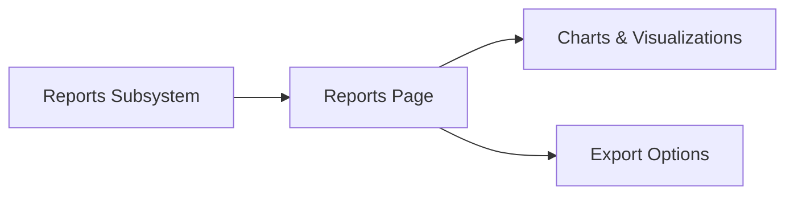

# Reports Page

> This document defines the Reports Page component, which provides the user interface for viewing, exploring, and exporting reports generated by TidyMind.

---

## Purpose

The Reports Page provides users with access to analytical reports and application insights generated by the Reports subsystem.

Its purpose is to visualize statistics, trends, summaries, and generated reports in a structured and interactive manner, enabling users to better understand their document library and application activity.

The Reports Page presents reports but does not generate them.

---

# Responsibilities

The Reports Page is responsible for:

* Displaying generated reports.
* Presenting statistics and trends.
* Visualizing analytical information.
* Supporting report filtering.
* Providing report export options.
* Enabling report navigation.

---

# Scope

### In Scope

* Report viewing
* Statistics visualization
* Charts and graphs
* Report filtering
* Report export
* Historical reporting

### Out of Scope

The Reports Page is **not** responsible for:

* Report generation
* Data analysis
* AI inference
* Database management
* Business logic
* Search execution

These responsibilities belong to other architectural components.

---

# Architectural Overview

The Reports Page retrieves generated reports from the Reports subsystem and presents them to the user.

The Reports Page acts as the presentation layer for generated reports and analytics.

---

# User Workflow

A typical reporting workflow consists of the following stages:

1. Open the Reports Page.
2. Select a report or dashboard.
3. Review statistics and visualizations.
4. Apply filters where required.
5. Export the report if desired.

The page should provide quick access to both high-level summaries and detailed reports.

---

# Displayed Information

The Reports Page may present information including:

| Information         | Description                                |
| ------------------- | ------------------------------------------ |
| Document Statistics | Counts, categories, storage usage.         |
| Processing Activity | Scans, AI processing, automation activity. |
| Duplicate Analysis  | Duplicate detection statistics.            |
| AI Insights         | Classification and summarization metrics.  |
| Storage Trends      | Growth and organization over time.         |
| Exported Reports    | Previously generated report outputs.       |

Additional report types may be introduced as the Reports subsystem evolves.

---

# User Experience Principles

The Reports Page should strive to be:

* Informative.
* Interactive.
* Readable.
* Consistent.
* Easy to explore.

Users should be able to understand trends and system activity through clear visual presentation.

---

# Design Principles

The Reports Page should remain:

* Read-oriented.
* Independent of report generation.
* Modular.
* Extensible.
* Focused on visualization.

Its responsibility is limited to presenting analytical information.

---

# Error Handling

The Reports Page should present reporting issues clearly.

Examples include:

* Missing reports.
* Incomplete statistics.
* Failed visualizations.
* Export failures.

Whenever practical, partial report data should remain available even if some report elements cannot be displayed.

---

# Future Considerations

The architecture should support future enhancements, including:

* Interactive dashboards.
* Custom report layouts.
* Scheduled report generation.
* Plugin-defined report views.
* Drill-down analytics.
* AI-generated report summaries.

These enhancements should preserve the Reports Page's primary responsibility of presenting reports and analytics.

---

# Related Documents

* [GUI Overview](00_Overview.md)
* [Dashboard](02_Dashboard.md)
* [Reports Overview](../09_Reports/00_Overview.md)
* [Statistics](../09_Reports/01_Statistics.md)
* [Export](../09_Reports/05_Export.md)
