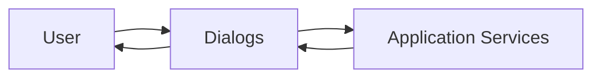

# Dialogs

> This document defines the Dialogs component, which provides temporary user interface elements for focused interaction, confirmation, and data entry within TidyMind.

---

## Purpose

The Dialogs component provides temporary interaction windows that guide users through specific tasks requiring attention, confirmation, or additional input.

Its purpose is to collect user decisions, present important information, and support focused workflows without disrupting the primary application interface.

Dialogs facilitate interaction but do not implement application logic.

---

# Responsibilities

The Dialogs component is responsible for:

* Displaying confirmation dialogs.
* Collecting user input.
* Presenting warnings and errors.
* Supporting guided workflows.
* Displaying configuration dialogs.
* Returning user decisions.

---

# Scope

### In Scope

* Confirmation dialogs
* Input dialogs
* Warning dialogs
* File and folder selection dialogs
* Progress dialogs
* Configuration dialogs

### Out of Scope

The Dialogs component is **not** responsible for:

* Executing business logic
* AI inference
* File scanning
* Rule execution
* Database operations
* Search execution

These responsibilities belong to other architectural components.

---

# Architectural Overview

Dialogs provide temporary interaction between the user and the application's underlying services.

Dialogs collect information or decisions before passing requests to the appropriate application subsystem.

---

# Dialog Workflow

A typical dialog interaction consists of the following stages:

1. Trigger a dialog.
2. Display relevant information.
3. Collect user input or confirmation.
4. Validate the entered information where appropriate.
5. Return the user's decision.
6. Close the dialog.

Dialogs should remain focused on a single interaction or decision.

---

# Dialog Categories

The architecture should support dialog types including:

| Dialog Type   | Purpose                                        |
| ------------- | ---------------------------------------------- |
| Confirmation  | Confirm potentially significant actions.       |
| Input         | Collect user-entered values.                   |
| Selection     | Choose files, folders, or options.             |
| Configuration | Configure application features.                |
| Progress      | Display the status of long-running operations. |
| Error         | Present recoverable or unrecoverable issues.   |

Additional dialog types may be introduced as the application evolves.

---

# User Experience Principles

Dialogs should be:

* Focused.
* Clear.
* Non-intrusive.
* Consistent.
* Easy to dismiss.

Dialogs should request only the information necessary to complete the current task.

---

# Design Principles

The Dialogs component should remain:

* Independent of business logic.
* Reusable.
* Modular.
* Extensible.
* Focused on interaction.

Its responsibility is limited to facilitating temporary user interactions.

---

# Error Handling

Dialogs should present issues clearly and provide meaningful recovery options whenever practical.

Examples include:

* Invalid user input.
* Missing required information.
* Operation conflicts.
* Permission issues.
* Unexpected failures.

Dialogs should help users resolve problems rather than simply reporting them.

---

# Future Considerations

The architecture should support future enhancements, including:

* Multi-step wizard dialogs.
* Plugin-defined dialogs.
* AI-assisted configuration dialogs.
* Accessibility improvements.
* Context-sensitive help.
* Reusable dialog templates.

These enhancements should preserve the Dialogs component's primary responsibility of collecting user interaction.

---

# Related Documents

* [GUI Overview](00_Overview.md)
* [Main Window](01_Main_Window.md)
* [Notifications](09_Notifications.md)
* [Settings Page](06_Settings_Page.md)
* [Results Page](04_Results_Page.md)
