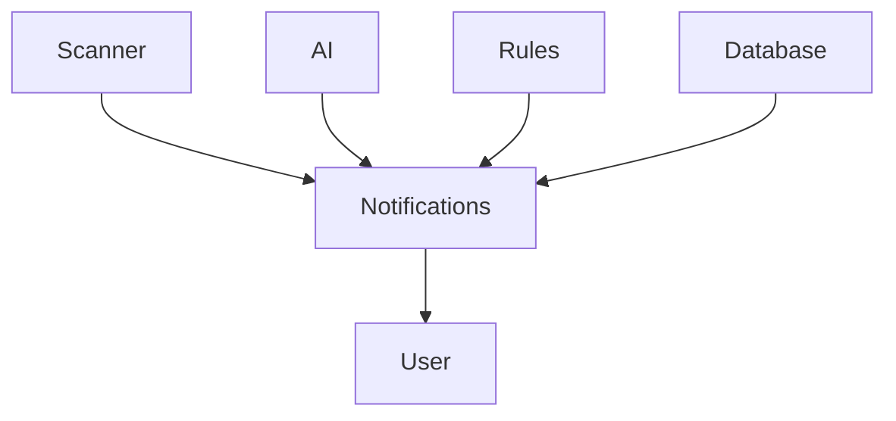

# Notifications

> This document defines the Notifications component, which provides non-intrusive feedback about application events, background tasks, and system status within TidyMind.

---

## Purpose

The Notifications component communicates important application events to users without interrupting their workflow.

Its purpose is to provide timely feedback regarding background processing, completed tasks, warnings, and informational messages while allowing users to continue working.

Notifications inform users but do not require user decisions.

---

# Responsibilities

The Notifications component is responsible for:

* Displaying informational messages.
* Reporting background task completion.
* Presenting warnings.
* Communicating application status.
* Providing progress updates where appropriate.
* Delivering non-blocking feedback.

---

# Scope

### In Scope

* Information notifications
* Success notifications
* Warning notifications
* Background task updates
* Progress notifications
* Status messages

### Out of Scope

The Notifications component is **not** responsible for:

* User confirmation
* Data entry
* Dialog workflows
* Business logic
* AI inference
* Application processing

These responsibilities belong to other architectural components.

---

# Architectural Overview

The Notifications component receives events from application subsystems and presents non-blocking feedback to the user.

Notifications communicate application events while allowing users to continue working uninterrupted.

---

# Notification Workflow

A typical notification workflow consists of the following stages:

1. A subsystem generates an event.
2. The notification system receives the event.
3. The notification is categorized.
4. The notification is displayed.
5. The notification expires or is dismissed.

Notifications should remain informative without requiring user interaction.

---

# Notification Categories

The architecture should support multiple notification types.

| Category            | Examples                                    |
| ------------------- | ------------------------------------------- |
| Information         | Scan started, indexing in progress          |
| Success             | Scan completed, backup finished             |
| Warning             | OCR partially failed, duplicate detected    |
| Error               | AI provider unavailable, file access denied |
| Background Activity | AI processing, indexing, report generation  |

Additional notification categories may be introduced as the application evolves.

---

# User Experience Principles

Notifications should be:

* Timely.
* Informative.
* Non-intrusive.
* Clear.
* Easy to dismiss.

Users should receive useful information without unnecessary interruptions.

---

# Design Principles

The Notifications component should remain:

* Independent of business logic.
* Event-driven.
* Lightweight.
* Extensible.
* Focused on communication.

Its responsibility is limited to informing users about application events.

---

# Error Handling

Notification failures should never affect application functionality.

Examples include:

* Failed notification display.
* Missing notification content.
* Notification queue overflow.
* Unsupported notification types.

Whenever practical, notification failures should be silently logged without interrupting the user's workflow.

---

# Future Considerations

The architecture should support future enhancements, including:

* Notification history.
* Notification grouping.
* Priority levels.
* User-configurable notification preferences.
* Plugin-defined notifications.
* Operating system notification integration.

These enhancements should preserve the Notifications component's primary responsibility of communicating application events.

---

# Related Documents

* [GUI Overview](00_Overview.md)
* [Dialogs](08_Dialogs.md)
* [History Page](05_History_Page.md)
* [Scanner Page](03_Scanner_Page.md)
* [Rules Overview](../07_Rules/00_Overview.md)
