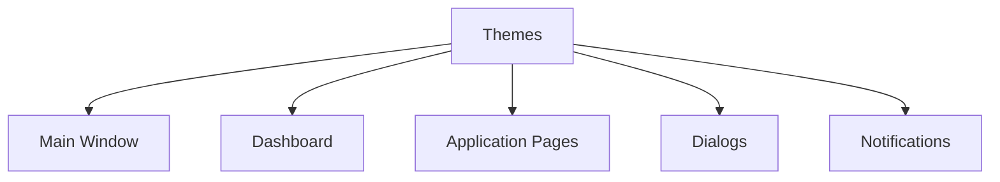

# Themes

> This document defines the Themes component, which is responsible for managing the visual appearance and presentation style of the TidyMind user interface.

---

## Purpose

The Themes component provides a consistent mechanism for controlling the visual appearance of the application.

Its purpose is to define colors, typography, spacing, icons, and other visual elements while ensuring a consistent and accessible user experience across all interface components.

Themes affect presentation only and do not modify application behavior.

---

# Responsibilities

The Themes component is responsible for:

* Managing visual themes.
* Defining color palettes.
* Managing typography.
* Supporting accessibility themes.
* Applying visual styling.
* Maintaining visual consistency.

---

# Scope

### In Scope

* Light and dark themes
* Color palettes
* Typography
* Icons
* Spacing
* Accessibility options
* Visual styling

### Out of Scope

The Themes component is **not** responsible for:

* Business logic
* Application configuration
* User workflows
* AI processing
* Search execution
* Rule execution

These responsibilities belong to other architectural components.

---

# Architectural Overview

The Themes component provides visual styling to all GUI components.

The Themes component provides a consistent visual identity across the application.

---

# Theme Elements

A theme may define visual characteristics including:

| Element    | Purpose                                            |
| ---------- | -------------------------------------------------- |
| Colors     | Primary, secondary, background, and accent colors. |
| Typography | Fonts, text sizes, and emphasis.                   |
| Icons      | Consistent iconography throughout the application. |
| Spacing    | Margins, padding, and layout density.              |
| Borders    | Visual separation between interface elements.      |
| Animations | Optional visual transitions and feedback.          |

Additional visual elements may be introduced as the application evolves.

---

# Theme Workflow

A typical theme workflow consists of the following stages:

1. Load the selected theme.
2. Validate theme resources.
3. Apply visual styling.
4. Update visible interface components.
5. Persist the selected theme preference.

Theme changes should take effect consistently across the application.

---

# User Experience Principles

Themes should be:

* Consistent.
* Accessible.
* Readable.
* Responsive.
* Visually cohesive.

Visual customization should enhance usability without affecting functionality.

---

# Design Principles

The Themes component should remain:

* Independent of application behavior.
* Modular.
* Extensible.
* Easy to customize.
* Focused on presentation.

Its responsibility is limited to controlling the visual appearance of the application.

---

# Error Handling

Theme-related issues should degrade gracefully.

Examples include:

* Missing theme resources.
* Invalid color definitions.
* Missing fonts.
* Unsupported visual assets.

Whenever practical, the application should fall back to a default theme without affecting functionality.

---

# Future Considerations

The architecture should support future enhancements, including:

* User-created themes.
* Theme marketplace.
* Plugin-defined themes.
* Automatic system theme detection.
* Accessibility-focused themes.
* Dynamic accent colors.

These enhancements should preserve the Themes component's primary responsibility of managing the application's visual appearance.

---

# Related Documents

* [GUI Overview](00_Overview.md)
* [Main Window](01_Main_Window.md)
* [Settings Page](06_Settings_Page.md)
* [Notifications](09_Notifications.md)
* [Dialogs](08_Dialogs.md)
